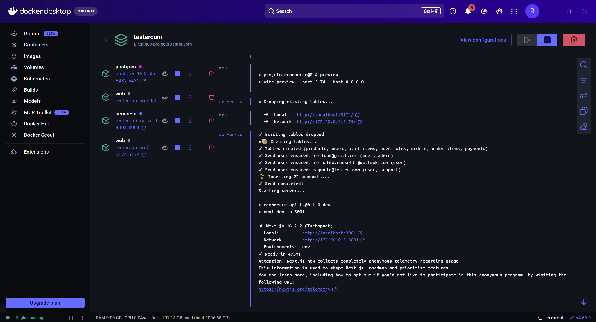

# 📊 Lançamento Tests Dashboard: Versão 0.2.0 🎯

É com orgulho que apresentamos a mais nova versão do nosso **Dashboard de Testes Automáticos**! Esta atualização (`v0.2.0`) traz uma reformulação arquitetural profunda, novas métricas de qualidade e uma esteira de CI/CD muito mais otimizada e inteligente.

Confira as grandes novidades:

### 🏗️ Arquitetura SPA e Nova Estrutura de Pastas
- Transformamos o dashboard em uma **Single Page Application (SPA)** de alta performance, centralizada no `index.html` com sistema de abas. Arquivos órfãos (como antigos `.html` de relatórios) foram removidos para um código limpo.
- **Estrutura Modular Profissional**: Código separado semanticamente em pastas `/src` (lógica e componentes JS), `/assets` (estilos e dados de fallback) e `/docs` (documentações).

### 📈 Métricas de Eficiência de QA (À Prova de Falhas)
- Inovamos com a nova seção de **Eficiência de QA** que calcula automaticamente dados cruciais como ROI, Densidade de Defeitos e Vazamento (Leakage).
- **Mecanismo de Fallback Inteligente**: O dashboard agora é resiliente a falhas de persistência na esteira. Se os dados consolidados do JSON falharem, um script (`computeQAEfficiencyFromData`) calcula e injeta tudo dinamicamente em tempo de execução para garantir que as métricas **nunca fiquem vazias**.

### ⚙️ Pipeline CI/CD Turbo
- Refatoração da pipeline de testes e-to-e (`e2e-pipeline.yml`).
- Implementamos **cache agressivo de NPM** nos jobs E2E, reduzindo drasticamente o tempo de build.
- Otimização dos logs de containers (exibidos apenas em caso de falha) e validação direta das novas métricas de QA no processo de deploy contínuo (GitHub Pages).
- Atualizamos todas as *GitHub Actions* para as suas versões mais modernas e seguras (`v4`).

### 📚 Documentação Elevada ao Padrão Ouro
- O `README.md` do dashboard foi **totalmente reescrito**. Ele agora inclui um guia de Quickstart, a tabela detalhada com o mapa mental de todos os jobs da esteira CI e um glossário completo das métricas utilizadas.

---

# 📱 Lançamento Mobile KMM: Versão 0.2.0 🚀

Fala, comunidade! É com muito orgulho que anuncio a mais nova atualização do nosso **App Mobile** do ecossistema AmazonQA. Totalmente escrito em **Kotlin Multiplatform (KMM)**, esta versão traz grandes refinamentos visuais, correção de cálculos essenciais e a tão esperada área de gestão administrativa direto do celular! 📲

Confira os destaques do que fizemos:

### 💼 Gestão de Produtos na Palma da Mão (Admin)
- **Novo Painel de Suporte**: Agora os administradores podem listar, editar e deletar produtos diretamente do aplicativo. 
- Implementamos a rota segura `admin_products` com uma UI moderna usando **Jetpack Compose** (incluindo Floating Action Buttons, Dialogs completos e listagem dinâmica).
- Arquitetura limpa preservada com novos UseCases, chamadas Ktor assíncronas no `ProductRepository` e injeção do `AdminProductsViewModel`.

### 🛒 Carrinho de Compras Impecável
- **Subtotal de Alta Precisão**: Identificamos e resolvemos o bug de cálculo no carrinho! Atualizamos a lógica para somar perfeitamente as quantias e valores utilizando `derivedStateOf`, garantindo excelente precisão e reatividade imediata no frontend.

### 🎨 Design Premium & Novo Branding
- Lançamos um **novo ícone de aplicativo Premium** destacando as diretrizes de QA e a identidade visual "Amazon".
🛠️ Otimização de UI: Refinamos o cabeçalho das telas de autenticação para um visual mais limpo e direto ao ponto.

### 🛡️ Segurança na Criação de Contas
- **Validação Client-Side Ativa**: Adicionamos validação inteligente na tela de "Criar Conta". Agora, tentativas de cadastro com campos vazios disparam mensagens de erro claras e amigáveis diretamente na UI antes mesmo de bater na API.

---

# 🚀 Novidades no Ar! Versão 0.5.0 (Plataforma Web) Disponível! 🌐

Fala, rede! 👋 É com muita alegria que compartilho os avanços da nossa plataforma de E-commerce. Esta versão traz um salto gigante em **autonomia de gestão** e **infraestrutura robusta**. Confira os destaques:

---

### 👩‍💻 Nova Área de Suporte (CRUD de Produtos)
Criamos um espaço exclusivo para o nosso time de suporte brilhar! Agora, sem precisar acessar códigos ou banco de dados, eles podem:
*   ✨ **Criar** novos produtos em segundos.
*   📝 **Editar** informações, preços e categorias.
*   🗑️ **Deletar** itens (com validação de segurança para não afetar pedidos ativos).
*   🔍 **Buscar** e filtrar o catálogo com alta performance.

---

### 🚢 Infraestrutura Inteligente com Docker
Adeus ao "na minha máquina funciona"! 😅 Agora, todo o nosso ecossistema — Backend (Next.js), Frontend (React) e Banco de Dados (Postgres) — roda em **containers Docker**. 
*   Basta um comando (`docker compose up`) e o ambiente está pronto em qualquer lugar.
*   Ambiente de desenvolvimento idêntico ao de produção.

---

### 🛠️ Gestão de Frete Dinâmica
Atendendo a pedidos, implementamos o campo `shipping_cost`. 📦 
*   Agora podemos definir frete grátis ou valores específicos para cada item.
*   O carrinho de compras calcula automaticamente o total e o subtotal, garantindo transparência total para o cliente.

---

### ✅ Qualidade Acima de Tudo
Continuamos firmes no nosso **DoD (Definition of Done)**:
*   🧪 **Cobertura de API Expandida**: Alcançamos a marca de **100 testes de API**! 💯 Adicionamos 27 novos testes focados em cenários negativos (validação de dados, segurança, limites de estoque e permissões), garantindo que nossa API seja resiliente a erros e tentativas de acesso indevido.
*   🛡️ **Segurança**: Novos papéis de acesso (`isSupport`) via JWT e validações cross-user em endpoints críticos.
*   🎭 **Testes E2E**: Cobertura ampliada com Playwright para validar fluxos complexos de frete e checkout em múltiplos navegadores.
*   💎 **Design Premium**: Dashboard refatorado com arquitetura modular e visual premium para acompanhamento em tempo real.

---

💡 **O que achou dessas atualizações?** Comente aqui embaixo! 🚀

#SoftwareEngineering #WebDevelopment #ReactJS #NextJS #Docker #QualityAssurance #Ecommerce #ProductManagement
