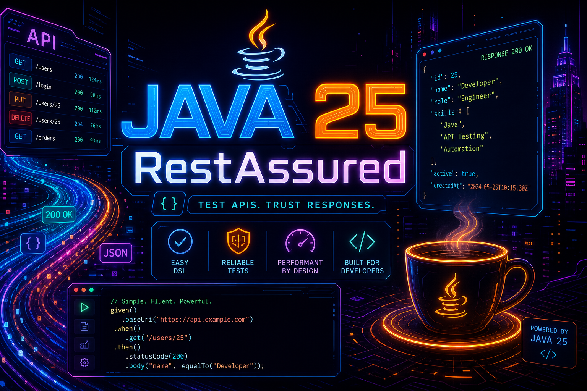
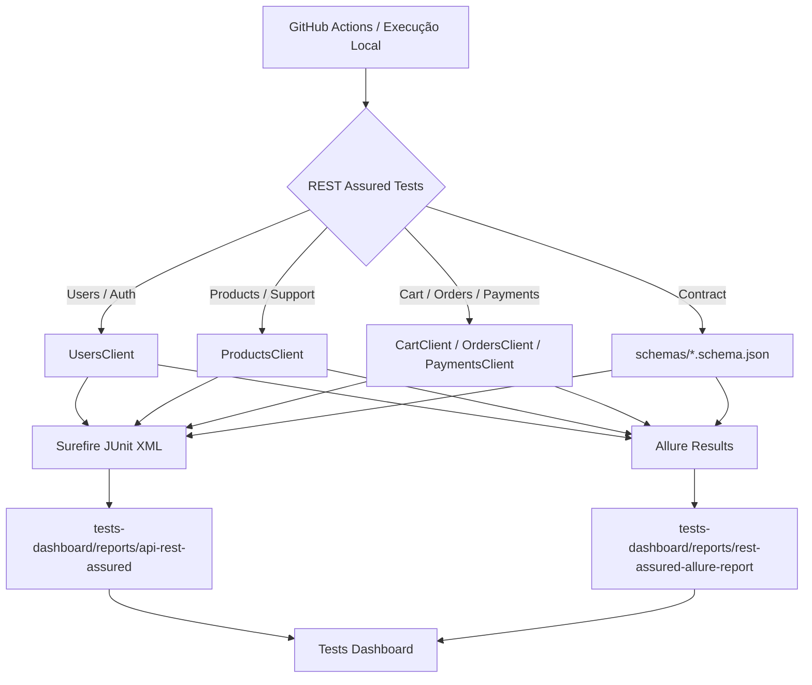
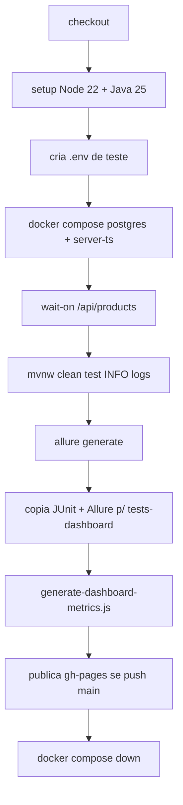
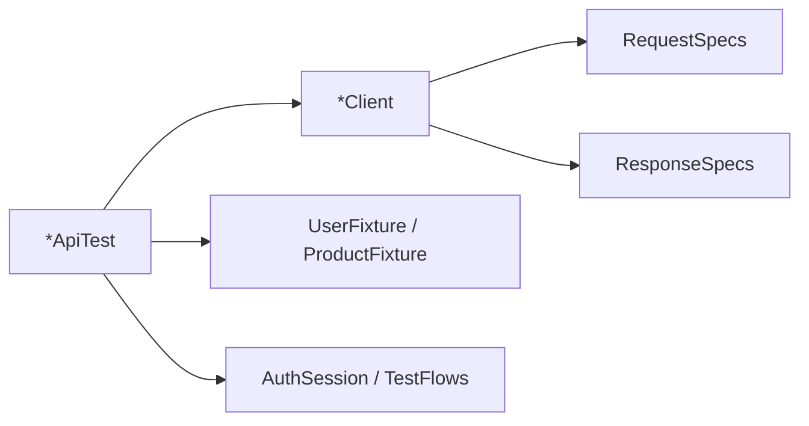

# 📊 Tests Dashboard



Uma suíte de testes de API com **Java 25**, **REST Assured**, **JUnit 5**, **JSON Schema**, **Log4j 2** e **Allure Report**.

O objetivo é simples: transformar validações técnicas de API em **evidência clara de qualidade**, fácil de entender por QA, desenvolvimento, liderança técnica e produto.

👉 **[Leia as regras de arquitetura do dashboard aqui](../../tests-dashboard/docs/RULES.md)**

---

## 🗂️ Estrutura de Pastas

```
projects-tests/rest-assured-api/
│
├── pom.xml                         # Dependências, plugins, Java 25 na CI e profiles Maven
├── mvnw / mvnw.cmd                 # Maven Wrapper para execução padronizada
├── .env                            # Configuração local de ambiente (não versionado)
│
├── docs/
│   └── java-25-restassured-banner.png
│
├── src/test/java/com/tester/api/
│   ├── base/                       # BaseApiTest e EnvironmentConfig
│   ├── client/                     # Clients REST por domínio: users, products, cart, orders, payments
│   ├── fixture/                    # Massa de dados com Datafaker e documentos brasileiros
│   ├── model/request/              # Records de payloads enviados para a API
│   ├── model/response/             # Records de respostas mapeadas
│   ├── specs/                      # RequestSpecs e ResponseSpecs reutilizáveis
│   ├── support/                    # AuthSession, TestFlows, EnvFileLoader e ClientLogging
│   └── tests/                      # Cenários por feature: Users, Products, Cart, Orders, Payments
│
├── src/test/resources/
│   ├── schemas/                    # JSON Schemas para validação de contrato
│   ├── log4j2.xml                  # Logs coloridos e níveis por ambiente
│   └── junit-platform.properties   # Paralelismo JUnit 5
│
├── allure-results/                 # Evidências geradas pelos testes
├── allure-report/                  # HTML Allure gerado localmente ou na CI
└── target/surefire-reports/        # Relatórios JUnit XML consumidos pelo dashboard
```

> **Nota:** `allure-results/`, `allure-report/`, `target/` e arquivos `.env` são artefatos de execução. Eles contam a história dos testes, mas não devem virar código-fonte versionado.

---

## 🚀 Dev Quickstart (local)

### 1. Inicie o servidor estático (da raiz do repo):

Antes de testar qualidade, precisamos ter uma API viva para validar.

```bash
cd server-ts
npm install
npm run seed
npm run dev
```

Ou, se quiser algo mais próximo da esteira:

```bash
docker compose up -d --build postgres server-ts
npx --yes wait-on@7.2.0 --timeout 120000 http://127.0.0.1:3001/api/products
```

### 2. Inicie a API de geração de métricas:

Configure o ambiente da suíte REST Assured:

```dotenv
BASE_URI=http://127.0.0.1:3001
BASE_PATH=/api

SEED_ADMIN_EMAIL=reiload@gmail.com
SEED_ADMIN_PASSWORD=rei2026@QA

SEED_SUPPORT_EMAIL=suporte@tester.com
SEED_SUPPORT_PASSWORD=suporte2026@QA
```

Depois execute:

```powershell
cd projects-tests/rest-assured-api
mvn test
```

### 3. Abra no navegador:

Depois da execução, gere o relatório visual:

```powershell
mvn allure:serve
```

Relatório publicado pela esteira:

```
https://reinaldorossetti.github.io/amazonQA.com/tests-dashboard/reports/rest-assured-allure-report/
```

Documentação Swagger da API:

```
https://reinaldorossetti.github.io/amazonQA.com/tests-dashboard/swagger/index.html
```

---

## ⚙️ Como funciona a Esteira CI

O arquivo `.github/workflows/rest-assured-api-pipeline.yml` executa uma validação completa da API em ambiente controlado.

```text
setup     -> Prepara Node.js 22, Java 25 Temurin e cache Maven
stack     -> Sobe PostgreSQL e server-ts com Docker Compose
tests     -> Executa a suíte REST Assured com logs em nível INFO
allure    -> Gera relatório Allure com evidências dos testes
dashboard -> Copia JUnit XML e Allure para o tests-dashboard
deploy    -> Publica os relatórios no GitHub Pages
```

### O que o `generate-dashboard-metrics.js` produz:

- `dashboard-metrics.json` — consolida o resultado mais recente da execução
- `history/YYYY-MM-DD-HHhMMmSSs.json` — mantém histórico para análise de tendência
- `history/dates.json` — lista as últimas execuções exibidas no dashboard
- `latest-scan.json` — ajuda a entender quais artefatos foram encontrados na CI

Na prática, isso transforma um comando de teste em informação útil para tomada de decisão: passou, falhou, onde falhou e qual impacto isso tem para a qualidade.

---

## 📐 Métricas de Eficiência de QA (Cálculos e Validação)

Testar API não é apenas validar status code. É proteger contrato, regra de negócio, segurança, fluxo de compra, autenticação, pagamento e integridade dos dados.

### 1. Automation ROI (Economia de Automação)

A automação com REST Assured reduz o tempo de validação manual em fluxos críticos da API.

- **Fórmula**: `(Tempo Manual - Tempo Automático) × Nº de Execuções × Valor da Hora`
- **Escopo do cálculo**: considera testes automatizados de API executados na CI e publicados no dashboard.
- **Pesos**:
    - Tempo Manual: tempo estimado para validar endpoints manualmente via Postman/Swagger
    - Tempo Automático: tempo real da suíte no Maven/Surefire
    - Valor da Hora: referência financeira para estimar retorno da automação
    - Nº de Execuções: histórico de snapshots publicados
- **Exemplo**: quanto mais a suíte roda de forma confiável na CI, maior é a economia de tempo e menor é o risco de regressão chegar tarde.

🧮 Validação do Cálculo (Cenário: 250 Testes)

Imagine 250 validações de API sendo feitas manualmente antes de uma release.

Se cada validação levar 3 minutos, temos 750 minutos de esforço manual. Automatizando, a mesma cobertura pode ser executada em poucos minutos na esteira, várias vezes por semana, com evidência auditável.

O valor não está apenas na economia financeira. O maior ganho está em **feedback rápido** e **confiança para entregar**.

### 2. Defect Density (Densidade de Defeitos)

Ajuda a observar onde a API concentra mais falhas por volume de código ou por domínio funcional.

- **Fórmula**: `Bugs Detectados / (Linhas de Código / 1000)`
- **Heurística**: falhas em endpoints críticos, como autenticação, carrinho, pedidos e pagamentos, indicam pontos de atenção para evolução da arquitetura.
- **Exemplo**: uma área com poucos endpoints e muitas falhas merece investigação antes de ganhar novas features.

### 3. Flakiness Rate (Taxa de Instabilidade)

Mede a confiabilidade da suíte. Teste instável é perigoso porque reduz a confiança da equipe.

- **Fórmula**: `(Testes Instáveis / Total de Testes) × 100`
- **Definição**: testes que alternam entre sucesso e falha sem mudança real no código.

Uma suíte de API saudável precisa ser rápida, determinística e fácil de diagnosticar.

### 4. Defect Leakage (Fuga de Defeitos)

Mostra o quanto o processo de qualidade está conseguindo segurar problemas antes da produção.

- **Fórmula**: `(Bugs de Produção / (Bugs de Produção + Bugs de QA)) × 100`
- **Fonte**: falhas encontradas na CI, evidências Allure, contratos JSON Schema e regressões em endpoints críticos.

Quanto menor a fuga, mais eficiente está o processo de qualidade.

### 5. Automation Coverage (Cobertura de Automação)

Mostra o quanto dos principais comportamentos da API está protegido por testes automatizados.

- **Fórmula**: `(Casos Automatizados / Casos Totais) × 100`
- **Nota**: nesta suíte, a cobertura passa por usuários, produtos, carrinho, pedidos, pagamentos, suporte e validação de contrato com JSON Schema.

Cobertura não é sobre quantidade por quantidade. É sobre proteger o que gera risco real para o produto.

---

## 🏗️ Arquitetura de Dados e Lógica de Geração

A suíte foi organizada para separar responsabilidade: teste conta a história, client executa a chamada, fixture prepara dados e schema valida contrato.

### Fluxograma de Dados



### 🔍 Lógica de Descoberta (Auto-Discovery)

1.  **Testes Unitários**: nesta suíte, o foco não é teste unitário; o papel principal é validar comportamento real da API.
2.  **Testes E2E (Playwright)**:
    *   A suíte REST Assured complementa os testes E2E.
    *   Ela valida a API sem browser, com feedback mais rápido.
    *   Os cenários espelham os specs Playwright de API para manter paridade de comportamento.
3.  **Persistência Híbrida**:
    *   **JUnit XML**: alimenta métricas do dashboard.
    *   **Allure HTML**: entrega evidência visual com severidade, feature, request/response e falhas.

## 📝 Notas Técnicas

- **API de Dados**: a suíte valida `server-ts` em `http://127.0.0.1:3001/api` localmente e na CI.
- **Internacionalização**: os dados e mensagens consideram o contexto PT-BR do projeto.
- **Debug**: localmente, o Log4j 2 pode mostrar corpo da response em DEBUG; na CI, o padrão é INFO para logs objetivos.
- **Extensibilidade**: para adicionar uma nova feature de API, siga o padrão `tests/<dominio>`, `client/<Dominio>Client`, fixtures dedicadas e schema quando houver contrato relevante.

---

Qualidade de API não é apenas “deu 200 OK”.

É saber se o contrato continua válido, se a regra de negócio está protegida, se o fluxo crítico ainda funciona e se o time consegue tomar decisões com evidência.

Essa é a proposta da suíte **REST Assured API** integrada ao **Tests Dashboard**.

#QualidadeDeSoftware #QA #TestAutomation #RestAssured #Java25 #APITesting #AllureReport #ContinuousTesting #DevOps
# 🧪 REST Assured API (`rest-assured-api`)

# JAVA 25 and RestAssured


Projeto de automação de testes de API focado em garantir a estabilidade e os contratos dos endpoints do sistema. Desenvolvido com **REST Assured**, **JUnit 5**, **Log4j 2** e **Allure**, esta suíte foi desenhada para tirar proveito da estabilidade e alta performance do **Java 25 (LTS)**, que é a versão oficial adotada em nossa esteira de integração contínua (CI) e o padrão recomendado para o projeto. 

Para consultar as rotas, *payloads* e regras de negócio testadas por essa suíte, acesse a documentação interativa da API em **[Swagger - Tester.com API](https://reinaldorossetti.github.io/amazonQA.com/tests-dashboard/swagger/index.html)**.

**Índice:** [Java e toolchain](#-java-e-toolchain) · [Visão das suítes](#-visão-geral-das-suítes) · [JSON Schema](#-validação-de-contrato-com-json-schema) · [Requisitos](#-requisitos) · [Passo a passo](#-passo-a-passo-executar-localmente) · [Estrutura](#-estrutura-de-pastas) · [Configuração `.env`](#-configuração-env) · [Logging](#-logging-log4j-2) · [Paralelismo](#-execução-paralela-junit) · [Executar testes](#-executar-todos-os-testes) · [Por domínio](#-executar-por-domínio) · [Esteira CI](#-esteira-github-actions) · [Allure e Dashboard](#-allure-report-e-dashboard) · [Arquitetura](#-arquitetura-da-suíte) · [Referências](#-referências-do-projeto)

---

## ☕ Introdução ao Java 21 a 26

Esta suíte de testes API trabalha com múltiplas versões Java para tirar proveito dos avanços de performance sem perder compatibilidade:

```text
Compilação              -> Java 21 (maven.compiler.release=21 no pom.xml)
Execução local opcional -> Java 26 via Maven Toolchains (.mvn/toolchains.xml + profile jdk26-toolchain)
Execução na CI          -> Java 25 Temurin (.github/workflows/rest-assured-api-pipeline.yml)
```

O código compila com **release 21**, mas as versões **25 (LTS)** e **26 (Early Access)** oferecem melhorias contínuas em I/O de rede e performance. Para forçar o JDK 26 localmente sem alterar o Java do seu sistema inteiro, usamos o `toolchains.xml` (veja [Requisitos](#instalar-e-configurar-o-jdk)).

```bash
java -version
# Local: 21+ obrigatório; 25/26 recomendado se usar toolchain
# CI: Temurin 25
```

---

## 🚀 Recursos Java — exemplos no projeto

Para deixar o código de automação de testes mais simples e legível, usamos recursos modernos do Java (10+):

### `record` — DTOs imutáveis mais curtos
Reduz muito a criação de classes para mapear os JSONs de *request* e *response*, tirando a necessidade de getters/setters e bibliotecas como Lombok.

Arquivo: `src/test/java/com/tester/api/model/request/LoginRequest.java`

```java
public record LoginRequest(String email, String password) {}
```

Arquivo: `src/test/java/com/tester/api/model/response/ProductResponse.java`

```java
public record ProductResponse(
  int id,
  String name,
  String description,
  double price,
  int categoryId
) {}
```

### `var` — Inferência de tipos de variáveis locais
Melhora a leitura evitando que o nome da classe seja repetido, focando mais no que a variável faz.

Arquivo: `src/test/java/com/tester/api/tests/cart/CartApiTest.java`

```java
var user = TestFlows.registerUser("Cart");
var listRes = CartClient.list(token, "userId=" + user.userId());
```

---

## 🗂️ Visão geral das suítes

Cenários em `src/test/java/com/tester/api/tests/*/*ApiTest.java`. Cada classe usa `@Epic("API")` e `@Feature(...)` para o Allure.

```text
UsersApiTest           -> Feature: Usuários           -> Espelho: web/e2e/specs/api/users.api.spec.ts
ProductsApiTest        -> Feature: Products           -> Espelho: products.api.spec.ts
CartApiTest            -> Feature: Cart               -> Espelho: cart.api.spec.ts
OrdersApiTest          -> Feature: Pedidos            -> Espelho: orders.api.spec.ts
PaymentsApiTest        -> Feature: Pagamentos         -> Espelho: payments.api.spec.ts
SupportProductsApiTest -> Feature: Suporte / produtos -> Espelho: support-products.api.spec.ts
```

**Camadas:** `*ApiTest` → `*Client` + `RequestSpecs` / `ResponseSpecs` → `*Fixture` / `AuthSession` / `TestFlows`.

Guia para agentes/IDE: [`.cursor/skills/rest-assured-api-tests/SKILL.md`](../../.cursor/skills/rest-assured-api-tests/SKILL.md)

---

## 🔎 Validação de contrato com JSON Schema

A suíte também valida o **formato do JSON retornado pela API**. Isso ajuda a identificar mudanças de contrato, como campos obrigatórios removidos, tipos alterados ou respostas que deixam de seguir o padrão esperado.

Os schemas ficam em `src/test/resources/schemas/` e são carregados no teste com `matchesJsonSchemaInClasspath`, seguindo o padrão do REST Assured para JSON Schema.

Exemplo usado no projeto:

```java
UsersClient.login(new LoginRequest(user.email(), user.password()))
    .then()
    .statusCode(200)
    .body(matchesJsonSchemaInClasspath("schemas/users-login-response.schema.json"));
```

### Schemas adicionados

```text
UsersApiTest
  Teste  -> deveValidarJsonSchemaDaRespostaDeLogin
  Schema -> schemas/users-login-response.schema.json

ProductsApiTest
  Teste  -> deveValidarJsonSchemaDaListaDeProdutos
  Schema -> schemas/products-list-response.schema.json

CartApiTest
  Teste  -> deveValidarJsonSchemaDaListaDoCarrinho
  Schema -> schemas/cart-list-response.schema.json

OrdersApiTest
  Teste  -> deveValidarJsonSchemaDaListaDePedidos
  Schema -> schemas/orders-list-response.schema.json

PaymentsApiTest
  Teste  -> deveValidarJsonSchemaDaRespostaDePagamento
  Schema -> schemas/payment-response.schema.json

SupportProductsApiTest
  Teste  -> apiSp13SupportDeveValidarJsonSchemaDoProdutoCriado
  Schema -> schemas/support-product-response.schema.json
```

Rodar somente os testes de schema:

```powershell
mvn test "-Dtest=UsersApiTest#deveValidarJsonSchemaDaRespostaDeLogin,ProductsApiTest#deveValidarJsonSchemaDaListaDeProdutos,CartApiTest#deveValidarJsonSchemaDaListaDoCarrinho,OrdersApiTest#deveValidarJsonSchemaDaListaDePedidos,PaymentsApiTest#deveValidarJsonSchemaDaRespostaDePagamento,SupportProductsApiTest#apiSp13SupportDeveValidarJsonSchemaDoProdutoCriado"
```

---

## ✅ Requisitos

- **JDK** — **21+** para compilar; **25** na CI; **26** opcional local com toolchains
- **Maven** — use o **Maven Wrapper** (`mvnw` / `mvnw.cmd`) em `projects-tests/rest-assured-api/`
- **API** — `server-ts` em `http://127.0.0.1:3001` com base path `/api`
- **Seed** — `npm run seed` em `server-ts/` (admin, suporte, usuários de teste)
- **Arquivo `.env`** — credenciais locais (não versionado; pode copiar do `selenium-e2e`)

### Instalar e configurar o JDK

1. Instale um **JDK 21 ou superior** ([Eclipse Temurin](https://adoptium.net/) ou distribuição corporativa). Para alinhar com a CI, **JDK 25** é suficiente.
2. (Opcional) Instale **JDK 25** e configure toolchains — veja abaixo.
3. Defina **`JAVA_HOME`** para a pasta raiz do JDK.
4. Confirme:

   ```bash
   java -version

   # Windows PowerShell
   echo $env:JAVA_HOME

   # Windows CMD
   echo %JAVA_HOME%
   ```

5. Reinicie terminal/IDE após alterar variáveis de ambiente.

### Toolchain JDK 26 (opcional, Windows)

Se você usa JDK 26 apenas no Maven (sem mudar o `JAVA_HOME` global):


2. Ajuste `jdkHome` para o seu JDK 26.
3. O profile `jdk26-toolchain` ativa automaticamente quando o arquivo existe.

---

## 📋 Passo a passo (executar localmente)

Siga na ordem na primeira execução.

### 1. Subir o backend

```bash
cd server-ts
npm install
npm run seed
npm run dev
```

Em outro terminal, confirme a API:

```bash
curl -s http://127.0.0.1:3001/api/products
```

Ou use Docker (como na CI):

```bash
# na raiz do repositório tester.com
docker compose up -d --build postgres server-ts
npx --yes wait-on@7.2.0 --timeout 120000 http://127.0.0.1:3001/api/products
```

### 2. Criar o `.env`

Arquivo: `projects-tests/rest-assured-api/.env` (gitignored).

```dotenv
BASE_URI=http://127.0.0.1:3001
BASE_PATH=/api

SEED_ADMIN_EMAIL=reiload@gmail.com
SEED_ADMIN_PASSWORD=rei2026@QA

SEED_SUPPORT_EMAIL=suporte@tester.com
SEED_SUPPORT_PASSWORD=suporte2026@QA
```

> Você pode reutilizar os mesmos e-mails/senhas do seed em `server-ts/` ou do `.env` do `selenium-e2e`.

**Precedência:** propriedade `-D` JVM > variável de ambiente do SO > `.env` > default do `pom.xml`.

### 3. Rodar todos os testes

**PowerShell:**

```powershell
cd projects-tests/rest-assured-api
.\mvnw.cmd clean test
```

**Git Bash / Linux / macOS:**

```bash
cd projects-tests/rest-assured-api
chmod +x mvnw
./mvnw clean test
```

**Da raiz do repo (Windows):**

```bat
projects-tests\rest-assured-api\mvnw.cmd clean test
```

### 4. Ver resultado no terminal

- Sucesso: `BUILD SUCCESS` e contagem de testes no Surefire.
- Falha: stack trace no console; detalhes em `target/surefire-reports/`.
- Logs HTTP: status em **INFO**; corpo da response em **DEBUG** (padrão local) — ver [Logging](#-logging-log4j-2).

### 5. Gerar e abrir o Allure (local)

```powershell
cd projects-tests/rest-assured-api
.\mvnw.cmd clean test
.\mvnw.cmd allure:serve
```

Ou com CLI:

```bash
allure generate allure-results -o allure-report --clean
allure open allure-report
```

### 6. Relatório publicado (após push na `main`)

Após a esteira [REST Assured API Pipeline](#-esteira-github-actions), os relatórios ficam no **Tests Dashboard** (GitHub Pages):

```text
Allure principal -> https://reinaldorossetti.github.io/amazonQA.com/tests-dashboard/reports/rest-assured-allure-report/
JUnit XML índice -> https://reinaldorossetti.github.io/amazonQA.com/tests-dashboard/reports/api-rest-assured/
Dashboard QA     -> https://reinaldorossetti.github.io/amazonQA.com/tests-dashboard/
```

No dashboard, os cards **Integração - REST Assured (Allure)** e **Integração - REST Assured (JUnit)** apontam para essas pastas.

---

## 📁 Estrutura de pastas

```
projects-tests/rest-assured-api/
├── pom.xml
├── mvnw / mvnw.cmd
├── .mvn/
│   ├── wrapper/
│   └── toolchains.xml          # opcional (JDK 26)
├── .env                        # credenciais locais (gitignored)
├── src/test/
│   ├── java/com/tester/api/
│   │   ├── base/               # BaseApiTest, EnvironmentConfig
│   │   ├── specs/              # RequestSpecs, ResponseSpecs
│   │   ├── client/             # UsersClient, ProductsClient, CartClient, …
│   │   ├── model/request|response/
│   │   ├── fixture/            # UserFixture, ProductFixture, BrazilianDocuments
│   │   ├── support/            # AuthSession, TestFlows, EnvFileLoader, ClientLogging
│   │   └── tests/              # *ApiTest por domínio
│   └── resources/
│       ├── schemas/            # JSON Schemas para validação de contrato
│       ├── log4j2.xml
│       └── junit-platform.properties
└── target/                     # gerado pelo Maven
    ├── surefire-reports/       # JUnit XML
    └── …
allure-results/                 # após mvn test
allure-report/                  # após allure generate ou CI
```

---

## ⚙️ Configuração (`.env`)

Alinhado ao seed de `server-ts/`:

```dotenv
BASE_URI=http://127.0.0.1:3001
BASE_PATH=/api

SEED_ADMIN_EMAIL=reiload@gmail.com
SEED_ADMIN_PASSWORD=rei2026@QA

SEED_SUPPORT_EMAIL=suporte@tester.com
SEED_SUPPORT_PASSWORD=suporte2026@QA
```

O [dotenv-java](https://github.com/cdimascio/dotenv-java) carrega o arquivo via `EnvFileLoader` no startup (`BaseApiTest` → `EnvironmentConfig`).

Override na linha de comando:

```powershell
.\mvnw.cmd test -DbaseUri=http://127.0.0.1:3001 -DbasePath=/api
```

---

## 📋 Logging (Log4j 2)

O módulo usa **somente Apache Log4j 2** (`org.apache.logging.log4j`). Configuração: `src/test/resources/log4j2.xml` ([Log4j 2.26.0](https://github.com/apache/logging-log4j2/releases)) — console com nível e mensagem coloridos. JUL de bibliotecas terceiras é redirecionado via `log4j-jul` no Surefire.

```text
INFO  -> Status HTTP em cada request nos *Client (ClientLogging.logResponse)
DEBUG -> Corpo da response (padrão local; desligado na CI)
```

**Local:** profile `api-client-debug` ativo por padrão — `mvn test` já loga status + body.

```powershell
.\mvnw.cmd test
```

Desligar debug localmente:

```powershell
.\mvnw.cmd test -Dapi.client.debug=false -Dapi.client.log.level=info
```

Desativar cores (CI / terminal sem ANSI):

```powershell
.\mvnw.cmd test -Dlog4j.skipJansi=true
```

---

## ⚡ Execução paralela (JUnit)

Arquivo: `src/test/resources/junit-platform.properties`.

```text
parallel.enabled     = true       -> Paralelismo JUnit 5 ativo
config.strategy      = fixed      -> Pool fixo
fixed.parallelism    = 3          -> Até 3 threads no pool
mode.classes.default = concurrent -> Classes *ApiTest em paralelo
mode.default         = concurrent -> Métodos @Test em paralelo na classe
```

Cada teste cria dados únicos (e-mail/CPF via **Datafaker**) para reduzir colisão entre threads.

Desabilitar paralelismo para debug:

```powershell
.\mvnw.cmd test "-Djunit.jupiter.execution.parallel.enabled=false"
# OR
mvn clean test "-Djunit.jupiter.execution.parallel.enabled=false"
```

---

## ▶️ Executar todos os testes

O Maven Wrapper fica em **`projects-tests/rest-assured-api/`**.

### Windows (PowerShell)

```powershell
cd projects-tests/rest-assured-api
.\mvnw.cmd clean test
```

### Windows (CMD)

```bat
cd projects-tests\rest-assured-api
mvnw.cmd clean test
```

### Git Bash / Linux / macOS

```bash
cd projects-tests/rest-assured-api
./mvnw clean test
```

### Maven de forma global

```bash
cd projects-tests/rest-assured-api
mvn clean test
```

### Problemas comuns

```text
Connection refused em 127.0.0.1:3001
  Causa   -> API parada
  Solução -> npm run dev em server-ts/ ou docker compose up

401 / 403 em fluxos admin
  Causa   -> Seed ou .env desatualizado
  Solução -> npm run seed e confira SEED_* no .env

PKIX path building failed
  Causa   -> Certificado corporativo
  Solução -> Truststore do JDK ou settings.xml corporativo

No tests were executed
  Causa   -> Filtro -Dtest errado
  Solução -> Use nome simples da classe: -Dtest=UsersApiTest
```

---

## 🎯 Executar por domínio

```powershell
cd projects-tests/rest-assured-api
.\mvnw.cmd test -Dtest=UsersApiTest
.\mvnw.cmd test -Dtest=ProductsApiTest,CartApiTest
.\mvnw.cmd test -Dtest=OrdersApiTest#deveCriarPedidoAPartirDoCarrinhoELimparCarrinho
```

> O filtro `-Dtest=…` segue a convenção do **Maven Surefire** (nome simples da classe, sem pacote).

---

## 🔄 Esteira GitHub Actions

Workflow: [`.github/workflows/rest-assured-api-pipeline.yml`](../../.github/workflows/rest-assured-api-pipeline.yml)

### Quando roda

Dispara em **push** para `main` quando há alterações em:

- `projects-tests/rest-assured-api/**`
- `server-ts/**`
- `docker-compose.yml`
- `tests-dashboard/**`
- o próprio workflow

### Fluxo do job



1. **Checkout** do repositório.
2. **Setup:** Node.js 22, **Java 25** Temurin (cache Maven).
3. **`.env`:** credenciais de seed para admin/suporte na CI.
4. **Stack:** `docker compose up -d --build postgres server-ts`.
5. **Readiness:** `wait-on` em `http://127.0.0.1:3001/api/products`.
6. **Testes:** `./mvnw clean test` com log **INFO** (`-Dapi.client.debug=false`, `-Dlog4j.skipJansi=true`). `continue-on-error: true` — relatórios são gerados mesmo com falhas.
7. **Allure:** CLI 2.34.0 → `allure-report/`.
8. **Cópia:** JUnit → `tests-dashboard/reports/api-rest-assured/`; Allure → `tests-dashboard/reports/rest-assured-allure-report/`; índice HTML para os XML.
9. **Dashboard:** `generate-dashboard-metrics.js` + publicação `peaceiris/actions-gh-pages@v4` (`keep_files: true`).
10. **Teardown:** `docker compose down` (`if: always()`).

Comando equivalente ao da esteira:

```bash
cd projects-tests/rest-assured-api
./mvnw clean test \
  -DbaseUri=http://127.0.0.1:3001 \
  -DbasePath=/api \
  -Dapi.client.debug=false \
  -Dapi.client.log.level=info \
  -Dlog4j.skipJansi=true
```

### Relatórios publicados

```text
Allure HTML    -> tests-dashboard/reports/rest-assured-allure-report/
JUnit Surefire -> tests-dashboard/reports/api-rest-assured/
Online Allure  -> https://reinaldorossetti.github.io/amazonQA.com/tests-dashboard/reports/rest-assured-allure-report/
Online JUnit   -> https://reinaldorossetti.github.io/amazonQA.com/tests-dashboard/reports/api-rest-assured/
```

> Verifique o status do job no GitHub Actions; com `continue-on-error: true`, o workflow pode concluir mesmo com testes falhando.

---

## 📊 Allure Report e Dashboard

### Relatório online (Allure)

**[https://reinaldorossetti.github.io/amazonQA.com/tests-dashboard/reports/rest-assured-allure-report/](https://reinaldorossetti.github.io/amazonQA.com/tests-dashboard/reports/rest-assured-allure-report/)**

Atualizado após cada push na `main` que dispara a pipeline REST Assured.

### Gerar localmente

1. Execute os testes (gera `allure-results/`):

   ```powershell
   cd projects-tests/rest-assured-api
   .\mvnw.cmd clean test
   ```

2. **HTML estático (Maven)**

   ```powershell
   .\mvnw.cmd allure:report
   ```

   Abra: `target/site/allure-maven/index.html`

3. **Servir no navegador**

   ```powershell
   .\mvnw.cmd allure:serve
   ```

4. **Allure CLI**

   ```bash
   allure generate allure-results -o allure-report --clean
   allure open allure-report
   ```

O filtro `AllureRestAssured` em `BaseApiTest` anexa request/response ao relatório quando a validação falha.

### JUnit no Dashboard

Índice com links para cada XML Surefire:

**[https://reinaldorossetti.github.io/amazonQA.com/tests-dashboard/reports/api-rest-assured/](https://reinaldorossetti.github.io/amazonQA.com/tests-dashboard/reports/api-rest-assured/)**

As métricas E2E do card **Integração - REST Assured** no [Tests Dashboard](https://reinaldorossetti.github.io/amazonQA.com/tests-dashboard/) são alimentadas por esses XML via `generate-dashboard-metrics.js`.

---

## 🧩 Arquitetura da suíte

Fluxo típico de um cenário:



```text
*ApiTest
  Responsabilidade -> Cenário, asserts Hamcrest/REST Assured, @DisplayName
  Exemplo          -> CartApiTest

*Client
  Responsabilidade -> Verbos HTTP, paths, logging
  Exemplo          -> OrdersClient

RequestSpecs / ResponseSpecs
  Responsabilidade -> Headers, auth, status esperados
  Exemplo          -> givenAdmin(), expectOk()

*Fixture
  Responsabilidade -> Payloads e dados aleatórios (Datafaker pt-BR)
  Exemplo          -> UserFixture.randomEmail()

AuthSession
  Responsabilidade -> Token JWT após login
  Exemplo          -> loginAsSupport()

BaseApiTest
  Responsabilidade -> RestAssured.baseURI, filtro Allure
  Exemplo          -> @BeforeAll globalSetup

schemas/*.schema.json
  Responsabilidade -> Contratos JSON das respostas principais
  Exemplo          -> users-login-response.schema.json
```

**Paridade Playwright:** mesmos endpoints e regras de negócio que `web/e2e/specs/api/*.api.spec.ts`; útil para regressão API sem browser.

---

## 📚 Referências do projeto

### Stack principal

```text
REST Assured
  Versão        -> 6.0.0
  Documentação  -> https://rest-assured.io/

REST Assured JSON Schema Validator
  Versão        -> 6.0.0
  Documentação  -> https://www.baeldung.com/rest-assured-json-schema

JUnit Jupiter
  Versão        -> 5.11.4
  Documentação  -> https://junit.org/junit5/docs/current/user-guide/

Hamcrest
  Versão        -> 3.0
  Documentação  -> http://hamcrest.org/

Allure JUnit 5
  Versão        -> 2.34.0
  Documentação  -> https://docs.qameta.io/allure/

Log4j 2
  Versão        -> 2.26.0
  Documentação  -> https://logging.apache.org/log4j/2.x/

Datafaker
  Versão        -> 2.5.4
  Documentação  -> https://www.datafaker.net/

dotenv-java
  Versão        -> 3.2.0
  Documentação  -> https://github.com/cdimascio/dotenv-java

Maven Surefire
  Versão        -> 3.5.5
  Documentação  -> https://maven.apache.org/surefire/maven-surefire-plugin/
```

### Monorepo

- **API** — `server-ts/` — backend testado
- **Specs Playwright API** — `web/e2e/specs/api/` — referência de cenários
- **Selenium E2E** — `projects-tests/selenium-e2e/` — mesmas credenciais `.env` possíveis
- **Tests Dashboard** — `tests-dashboard/` — publicação gh-pages e métricas
- **Docker Compose** — `docker-compose.yml` — stack na CI

### Arquivos de configuração

- `pom.xml` — dependências, profiles `api-client-debug` e `jdk26-toolchain`
- `.env` — `BASE_URI`, `BASE_PATH`, `SEED_*`
- `src/test/resources/schemas/*.schema.json` — contratos JSON usados por `matchesJsonSchemaInClasspath`
- `src/test/resources/log4j2.xml` — níveis e cores de log
- `src/test/resources/junit-platform.properties` — paralelismo
- `.github/workflows/rest-assured-api-pipeline.yml` — esteira CI + publicação de relatórios
