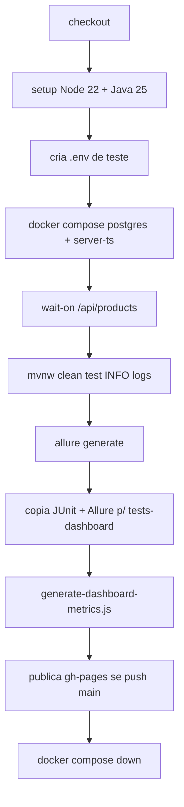
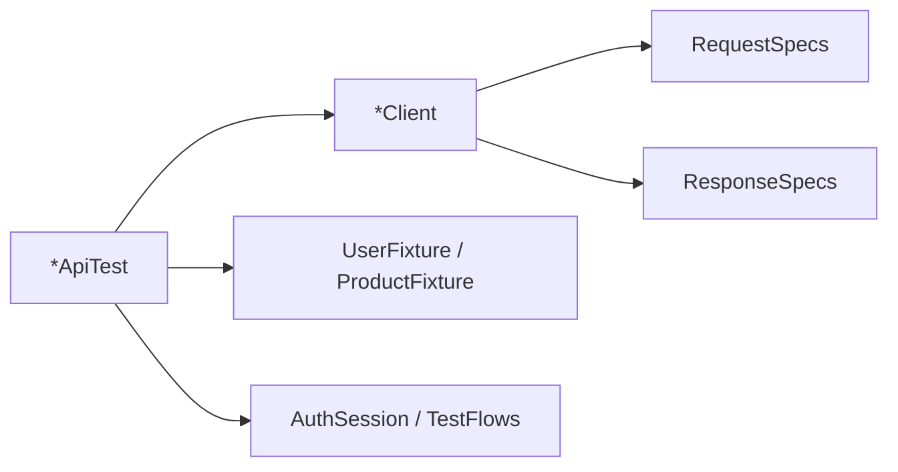

# 🧪 REST Assured API (`rest-assured-api`)

Projeto de automação de testes de API focado em garantir a estabilidade e os contratos dos endpoints do sistema. Desenvolvido com **REST Assured**, **JUnit 5**, **Log4j 2** e **Allure**, esta suíte foi desenhada para tirar proveito da estabilidade e alta performance do **Java 25 (LTS)**, que é a versão oficial adotada em nossa esteira de integração contínua (CI) e o padrão recomendado para o projeto. 

Para consultar as rotas, *payloads* e regras de negócio testadas por essa suíte, acesse a documentação interativa da API em **[Swagger - Tester.com API](https://reinaldorossetti.github.io/amazonQA.com/tests-dashboard/swagger/index.html)**.

**Índice:** [Java e toolchain](#-java-e-toolchain) · [Visão das suítes](#-visão-geral-das-suítes) · [JSON Schema](#-validação-de-contrato-com-json-schema) · [Requisitos](#-requisitos) · [Passo a passo](#-passo-a-passo-executar-localmente) · [Estrutura](#-estrutura-de-pastas) · [Configuração `.env`](#-configuração-env) · [Logging](#-logging-log4j-2) · [Paralelismo](#-execução-paralela-junit) · [Executar testes](#-executar-todos-os-testes) · [Por domínio](#-executar-por-domínio) · [Esteira CI](#-esteira-github-actions) · [Allure e Dashboard](#-allure-report-e-dashboard) · [Arquitetura](#-arquitetura-da-suíte) · [Referências](#-referências-do-projeto)

---

## ☕ Introdução ao Java 21 a 26

Esta suíte de testes API trabalha com múltiplas versões Java para tirar proveito dos avanços de performance sem perder compatibilidade:

| Papel | Versão | Onde |
|-------|--------|------|
| **Compilação** | **21** (`maven.compiler.release=21` no `pom.xml`) | Bytecode e linguagem dos testes |
| **Execução local (opcional)** | **26** via Maven Toolchains | `.mvn/toolchains.xml` + profile `jdk26-toolchain` |
| **Execução na CI** | **25** (Temurin) | [`.github/workflows/rest-assured-api-pipeline.yml`](../../.github/workflows/rest-assured-api-pipeline.yml) |

O código compila com **release 21**, mas as versões **25 (LTS)** e **26 (Early Access)** oferecem melhorias contínuas em I/O de rede e performance. Para forçar o JDK 26 localmente sem alterar o Java do seu sistema inteiro, usamos o `toolchains.xml` (veja [Requisitos](#instalar-e-configurar-o-jdk)).

```bash
java -version
# Local: 21+ obrigatório; 25/26 recomendado se usar toolchain
# CI: Temurin 25
```

---

## 🚀 Recursos Java — exemplos no projeto

Para deixar o código de automação de testes mais simples e legível, usamos recursos modernos do Java (10+):

### `record` — DTOs imutáveis mais curtos
Reduz muito a criação de classes para mapear os JSONs de *request* e *response*, tirando a necessidade de getters/setters e bibliotecas como Lombok.

Arquivo: `src/test/java/com/tester/api/model/request/LoginRequest.java`

```java
public record LoginRequest(String email, String password) {}
```

Arquivo: `src/test/java/com/tester/api/model/response/ProductResponse.java`

```java
public record ProductResponse(
  int id,
  String name,
  String description,
  double price,
  int categoryId
) {}
```

### `var` — Inferência de tipos de variáveis locais
Melhora a leitura evitando que o nome da classe seja repetido, focando mais no que a variável faz.

Arquivo: `src/test/java/com/tester/api/tests/cart/CartApiTest.java`

```java
var user = TestFlows.registerUser("Cart");
var listRes = CartClient.list(token, "userId=" + user.userId());
```

---

## 🗂️ Visão geral das suítes

Cenários em `src/test/java/com/tester/api/tests/*/*ApiTest.java`. Cada classe usa `@Epic("API")` e `@Feature(...)` para o Allure.

| Classe | Feature Allure | Espelho Playwright |
|--------|----------------|-------------------|
| `UsersApiTest` | Usuários | `web/e2e/specs/api/users.api.spec.ts` |
| `ProductsApiTest` | Products | `products.api.spec.ts` |
| `CartApiTest` | Cart | `cart.api.spec.ts` |
| `OrdersApiTest` | Pedidos | `orders.api.spec.ts` |
| `PaymentsApiTest` | Pagamentos | `payments.api.spec.ts` |
| `SupportProductsApiTest` | Suporte / produtos | `support-products.api.spec.ts` |

**Camadas:** `*ApiTest` → `*Client` + `RequestSpecs` / `ResponseSpecs` → `*Fixture` / `AuthSession` / `TestFlows`.

Guia para agentes/IDE: [`.cursor/skills/rest-assured-api-tests/SKILL.md`](../../.cursor/skills/rest-assured-api-tests/SKILL.md)

---

## 🔎 Validação de contrato com JSON Schema

A suíte também valida o **formato do JSON retornado pela API**. Isso ajuda a identificar mudanças de contrato, como campos obrigatórios removidos, tipos alterados ou respostas que deixam de seguir o padrão esperado.

Os schemas ficam em `src/test/resources/schemas/` e são carregados no teste com `matchesJsonSchemaInClasspath`, seguindo o padrão do REST Assured para JSON Schema.

Exemplo usado no projeto:

```java
UsersClient.login(new LoginRequest(user.email(), user.password()))
    .then()
    .statusCode(200)
    .body(matchesJsonSchemaInClasspath("schemas/users-login-response.schema.json"));
```

### Schemas adicionados

| Feature | Teste | Schema |
|---------|-------|--------|
| `UsersApiTest` | `deveValidarJsonSchemaDaRespostaDeLogin` | `schemas/users-login-response.schema.json` |
| `ProductsApiTest` | `deveValidarJsonSchemaDaListaDeProdutos` | `schemas/products-list-response.schema.json` |
| `CartApiTest` | `deveValidarJsonSchemaDaListaDoCarrinho` | `schemas/cart-list-response.schema.json` |
| `OrdersApiTest` | `deveValidarJsonSchemaDaListaDePedidos` | `schemas/orders-list-response.schema.json` |
| `PaymentsApiTest` | `deveValidarJsonSchemaDaRespostaDePagamento` | `schemas/payment-response.schema.json` |
| `SupportProductsApiTest` | `apiSp13SupportDeveValidarJsonSchemaDoProdutoCriado` | `schemas/support-product-response.schema.json` |

Rodar somente os testes de schema:

```powershell
mvn test "-Dtest=UsersApiTest#deveValidarJsonSchemaDaRespostaDeLogin,ProductsApiTest#deveValidarJsonSchemaDaListaDeProdutos,CartApiTest#deveValidarJsonSchemaDaListaDoCarrinho,OrdersApiTest#deveValidarJsonSchemaDaListaDePedidos,PaymentsApiTest#deveValidarJsonSchemaDaRespostaDePagamento,SupportProductsApiTest#apiSp13SupportDeveValidarJsonSchemaDoProdutoCriado"
```

---

## ✅ Requisitos

- **JDK** — **21+** para compilar; **25** na CI; **26** opcional local com toolchains
- **Maven** — use o **Maven Wrapper** (`mvnw` / `mvnw.cmd`) em `projects-tests/rest-assured-api/`
- **API** — `server-ts` em `http://127.0.0.1:3001` com base path `/api`
- **Seed** — `npm run seed` em `server-ts/` (admin, suporte, usuários de teste)
- **Arquivo `.env`** — credenciais locais (não versionado; pode copiar do `selenium-e2e`)

### Instalar e configurar o JDK

1. Instale um **JDK 21 ou superior** ([Eclipse Temurin](https://adoptium.net/) ou distribuição corporativa). Para alinhar com a CI, **JDK 25** é suficiente.
2. (Opcional) Instale **JDK 25** e configure toolchains — veja abaixo.
3. Defina **`JAVA_HOME`** para a pasta raiz do JDK.
4. Confirme:

   ```bash
   java -version

   # Windows PowerShell
   echo $env:JAVA_HOME

   # Windows CMD
   echo %JAVA_HOME%
   ```

5. Reinicie terminal/IDE após alterar variáveis de ambiente.

### Toolchain JDK 26 (opcional, Windows)

Se você usa JDK 26 apenas no Maven (sem mudar o `JAVA_HOME` global):


2. Ajuste `jdkHome` para o seu JDK 26.
3. O profile `jdk26-toolchain` ativa automaticamente quando o arquivo existe.

---

## 📋 Passo a passo (executar localmente)

Siga na ordem na primeira execução.

### 1. Subir o backend

```bash
cd server-ts
npm install
npm run seed
npm run dev
```

Em outro terminal, confirme a API:

```bash
curl -s http://127.0.0.1:3001/api/products
```

Ou use Docker (como na CI):

```bash
# na raiz do repositório tester.com
docker compose up -d --build postgres server-ts
npx --yes wait-on@7.2.0 --timeout 120000 http://127.0.0.1:3001/api/products
```

### 2. Criar o `.env`

Arquivo: `projects-tests/rest-assured-api/.env` (gitignored).

```dotenv
BASE_URI=http://127.0.0.1:3001
BASE_PATH=/api

SEED_ADMIN_EMAIL=reiload@gmail.com
SEED_ADMIN_PASSWORD=rei2026@QA

SEED_SUPPORT_EMAIL=suporte@tester.com
SEED_SUPPORT_PASSWORD=suporte2026@QA
```

> Você pode reutilizar os mesmos e-mails/senhas do seed em `server-ts/` ou do `.env` do `selenium-e2e`.

**Precedência:** propriedade `-D` JVM > variável de ambiente do SO > `.env` > default do `pom.xml`.

### 3. Rodar todos os testes

**PowerShell:**

```powershell
cd projects-tests/rest-assured-api
.\mvnw.cmd clean test
```

**Git Bash / Linux / macOS:**

```bash
cd projects-tests/rest-assured-api
chmod +x mvnw
./mvnw clean test
```

**Da raiz do repo (Windows):**

```bat
projects-tests\rest-assured-api\mvnw.cmd clean test
```

### 4. Ver resultado no terminal

- Sucesso: `BUILD SUCCESS` e contagem de testes no Surefire.
- Falha: stack trace no console; detalhes em `target/surefire-reports/`.
- Logs HTTP: status em **INFO**; corpo da response em **DEBUG** (padrão local) — ver [Logging](#-logging-log4j-2).

### 5. Gerar e abrir o Allure (local)

```powershell
cd projects-tests/rest-assured-api
.\mvnw.cmd clean test
.\mvnw.cmd allure:serve
```

Ou com CLI:

```bash
allure generate allure-results -o allure-report --clean
allure open allure-report
```

### 6. Relatório publicado (após push na `main`)

Após a esteira [REST Assured API Pipeline](#-esteira-github-actions), os relatórios ficam no **Tests Dashboard** (GitHub Pages):

| Relatório | URL |
|-----------|-----|
| **Allure (principal)** | [https://reinaldorossetti.github.io/amazonQA.com/tests-dashboard/reports/rest-assured-allure-report/](https://reinaldorossetti.github.io/amazonQA.com/tests-dashboard/reports/rest-assured-allure-report/) |
| **JUnit XML (índice)** | [https://reinaldorossetti.github.io/amazonQA.com/tests-dashboard/reports/api-rest-assured/](https://reinaldorossetti.github.io/amazonQA.com/tests-dashboard/reports/api-rest-assured/) |
| **Dashboard QA** | [https://reinaldorossetti.github.io/amazonQA.com/tests-dashboard/](https://reinaldorossetti.github.io/amazonQA.com/tests-dashboard/) |

No dashboard, os cards **Integração - REST Assured (Allure)** e **Integração - REST Assured (JUnit)** apontam para essas pastas.

---

## 📁 Estrutura de pastas

```
projects-tests/rest-assured-api/
├── pom.xml
├── mvnw / mvnw.cmd
├── .mvn/
│   ├── wrapper/
│   └── toolchains.xml          # opcional (JDK 26)
├── .env                        # credenciais locais (gitignored)
├── src/test/
│   ├── java/com/tester/api/
│   │   ├── base/               # BaseApiTest, EnvironmentConfig
│   │   ├── specs/              # RequestSpecs, ResponseSpecs
│   │   ├── client/             # UsersClient, ProductsClient, CartClient, …
│   │   ├── model/request|response/
│   │   ├── fixture/            # UserFixture, ProductFixture, BrazilianDocuments
│   │   ├── support/            # AuthSession, TestFlows, EnvFileLoader, ClientLogging
│   │   └── tests/              # *ApiTest por domínio
│   └── resources/
│       ├── schemas/            # JSON Schemas para validação de contrato
│       ├── log4j2.xml
│       └── junit-platform.properties
└── target/                     # gerado pelo Maven
    ├── surefire-reports/       # JUnit XML
    └── …
allure-results/                 # após mvn test
allure-report/                  # após allure generate ou CI
```

---

## ⚙️ Configuração (`.env`)

Alinhado ao seed de `server-ts/`:

```dotenv
BASE_URI=http://127.0.0.1:3001
BASE_PATH=/api

SEED_ADMIN_EMAIL=reiload@gmail.com
SEED_ADMIN_PASSWORD=rei2026@QA

SEED_SUPPORT_EMAIL=suporte@tester.com
SEED_SUPPORT_PASSWORD=suporte2026@QA
```

O [dotenv-java](https://github.com/cdimascio/dotenv-java) carrega o arquivo via `EnvFileLoader` no startup (`BaseApiTest` → `EnvironmentConfig`).

Override na linha de comando:

```powershell
.\mvnw.cmd test -DbaseUri=http://127.0.0.1:3001 -DbasePath=/api
```

---

## 📋 Logging (Log4j 2)

O módulo usa **somente Apache Log4j 2** (`org.apache.logging.log4j`). Configuração: `src/test/resources/log4j2.xml` ([Log4j 2.26.0](https://github.com/apache/logging-log4j2/releases)) — console com nível e mensagem coloridos. JUL de bibliotecas terceiras é redirecionado via `log4j-jul` no Surefire.

| Nível | Quando |
|-------|--------|
| **INFO** | Status HTTP em cada request nos `*Client` (`ClientLogging.logResponse`) |
| **DEBUG** | Corpo da response (padrão local; desligado na CI) |

**Local:** profile `api-client-debug` ativo por padrão — `mvn test` já loga status + body.

```powershell
.\mvnw.cmd test
```

Desligar debug localmente:

```powershell
.\mvnw.cmd test -Dapi.client.debug=false -Dapi.client.log.level=info
```

Desativar cores (CI / terminal sem ANSI):

```powershell
.\mvnw.cmd test -Dlog4j.skipJansi=true
```

---

## ⚡ Execução paralela (JUnit)

Arquivo: `src/test/resources/junit-platform.properties`.

| Propriedade | Valor | Significado |
|-------------|-------|-------------|
| `parallel.enabled` | `true` | Paralelismo JUnit 5 ativo |
| `config.strategy` | `fixed` | Pool fixo |
| `fixed.parallelism` | `3` | Até 3 threads no pool |
| `mode.classes.default` | `concurrent` | Classes `*ApiTest` em paralelo |
| `mode.default` | `concurrent` | Métodos `@Test` em paralelo na classe |

Cada teste cria dados únicos (e-mail/CPF via **Datafaker**) para reduzir colisão entre threads.

Desabilitar paralelismo para debug:

```powershell
.\mvnw.cmd test "-Djunit.jupiter.execution.parallel.enabled=false"
# OR
mvn clean test "-Djunit.jupiter.execution.parallel.enabled=false"
```

---

## ▶️ Executar todos os testes

O Maven Wrapper fica em **`projects-tests/rest-assured-api/`**.

### Windows (PowerShell)

```powershell
cd projects-tests/rest-assured-api
.\mvnw.cmd clean test
```

### Windows (CMD)

```bat
cd projects-tests\rest-assured-api
mvnw.cmd clean test
```

### Git Bash / Linux / macOS

```bash
cd projects-tests/rest-assured-api
./mvnw clean test
```

### Maven de forma global

```bash
cd projects-tests/rest-assured-api
mvn clean test
```

### Problemas comuns

| Sintoma | Causa provável | Solução |
|---------|----------------|---------|
| `Connection refused` em `127.0.0.1:3001` | API parada | `npm run dev` em `server-ts/` ou `docker compose up` |
| `401` / `403` em fluxos admin | Seed ou `.env` desatualizado | `npm run seed` e confira `SEED_*` no `.env` |
| `PKIX path building failed` | Certificado corporativo | Truststore do JDK ou `settings.xml` corporativo |
| `No tests were executed` | Filtro `-Dtest` errado | Use nome simples da classe: `-Dtest=UsersApiTest` |

---

## 🎯 Executar por domínio

```powershell
cd projects-tests/rest-assured-api
.\mvnw.cmd test -Dtest=UsersApiTest
.\mvnw.cmd test -Dtest=ProductsApiTest,CartApiTest
.\mvnw.cmd test -Dtest=OrdersApiTest#deveCriarPedidoAPartirDoCarrinhoELimparCarrinho
```

> O filtro `-Dtest=…` segue a convenção do **Maven Surefire** (nome simples da classe, sem pacote).

---

## 🔄 Esteira GitHub Actions

Workflow: [`.github/workflows/rest-assured-api-pipeline.yml`](../../.github/workflows/rest-assured-api-pipeline.yml)

### Quando roda

Dispara em **push** para `main` quando há alterações em:

- `projects-tests/rest-assured-api/**`
- `server-ts/**`
- `docker-compose.yml`
- `tests-dashboard/**`
- o próprio workflow

### Fluxo do job



1. **Checkout** do repositório.
2. **Setup:** Node.js 22, **Java 25** Temurin (cache Maven).
3. **`.env`:** credenciais de seed para admin/suporte na CI.
4. **Stack:** `docker compose up -d --build postgres server-ts`.
5. **Readiness:** `wait-on` em `http://127.0.0.1:3001/api/products`.
6. **Testes:** `./mvnw clean test` com log **INFO** (`-Dapi.client.debug=false`, `-Dlog4j.skipJansi=true`). `continue-on-error: true` — relatórios são gerados mesmo com falhas.
7. **Allure:** CLI 2.34.0 → `allure-report/`.
8. **Cópia:** JUnit → `tests-dashboard/reports/api-rest-assured/`; Allure → `tests-dashboard/reports/rest-assured-allure-report/`; índice HTML para os XML.
9. **Dashboard:** `generate-dashboard-metrics.js` + publicação `peaceiris/actions-gh-pages@v4` (`keep_files: true`).
10. **Teardown:** `docker compose down` (`if: always()`).

Comando equivalente ao da esteira:

```bash
cd projects-tests/rest-assured-api
./mvnw clean test \
  -DbaseUri=http://127.0.0.1:3001 \
  -DbasePath=/api \
  -Dapi.client.debug=false \
  -Dapi.client.log.level=info \
  -Dlog4j.skipJansi=true
```

### Relatórios publicados

| Destino | Caminho no repo / gh-pages |
|---------|----------------------------|
| Allure HTML | `tests-dashboard/reports/rest-assured-allure-report/` |
| JUnit Surefire | `tests-dashboard/reports/api-rest-assured/` |
| Online (Allure) | [rest-assured-allure-report](https://reinaldorossetti.github.io/amazonQA.com/tests-dashboard/reports/rest-assured-allure-report/) |
| Online (JUnit) | [api-rest-assured](https://reinaldorossetti.github.io/amazonQA.com/tests-dashboard/reports/api-rest-assured/) |

> Verifique o status do job no GitHub Actions; com `continue-on-error: true`, o workflow pode concluir mesmo com testes falhando.

---

## 📊 Allure Report e Dashboard

### Relatório online (Allure)

**[https://reinaldorossetti.github.io/amazonQA.com/tests-dashboard/reports/rest-assured-allure-report/](https://reinaldorossetti.github.io/amazonQA.com/tests-dashboard/reports/rest-assured-allure-report/)**

Atualizado após cada push na `main` que dispara a pipeline REST Assured.

### Gerar localmente

1. Execute os testes (gera `allure-results/`):

   ```powershell
   cd projects-tests/rest-assured-api
   .\mvnw.cmd clean test
   ```

2. **HTML estático (Maven)**

   ```powershell
   .\mvnw.cmd allure:report
   ```

   Abra: `target/site/allure-maven/index.html`

3. **Servir no navegador**

   ```powershell
   .\mvnw.cmd allure:serve
   ```

4. **Allure CLI**

   ```bash
   allure generate allure-results -o allure-report --clean
   allure open allure-report
   ```

O filtro `AllureRestAssured` em `BaseApiTest` anexa request/response ao relatório quando a validação falha.

### JUnit no Dashboard

Índice com links para cada XML Surefire:

**[https://reinaldorossetti.github.io/amazonQA.com/tests-dashboard/reports/api-rest-assured/](https://reinaldorossetti.github.io/amazonQA.com/tests-dashboard/reports/api-rest-assured/)**

As métricas E2E do card **Integração - REST Assured** no [Tests Dashboard](https://reinaldorossetti.github.io/amazonQA.com/tests-dashboard/) são alimentadas por esses XML via `generate-dashboard-metrics.js`.

---

## 🧩 Arquitetura da suíte

Fluxo típico de um cenário:



| Camada | Responsabilidade | Exemplo |
|--------|------------------|---------|
| **`*ApiTest`** | Cenário, asserts Hamcrest/REST Assured, `@DisplayName` | `CartApiTest` |
| **`*Client`** | Verbos HTTP, paths, logging | `OrdersClient` |
| **`RequestSpecs` / `ResponseSpecs`** | Headers, auth, status esperados | `givenAdmin()`, `expectOk()` |
| **`*Fixture`** | Payloads e dados aleatórios (Datafaker pt-BR) | `UserFixture.randomEmail()` |
| **`AuthSession`** | Token JWT após login | `loginAsSupport()` |
| **`BaseApiTest`** | `RestAssured.baseURI`, filtro Allure | `@BeforeAll globalSetup` |
| **`schemas/*.schema.json`** | Contratos JSON das respostas principais | `users-login-response.schema.json` |

**Paridade Playwright:** mesmos endpoints e regras de negócio que `web/e2e/specs/api/*.api.spec.ts`; útil para regressão API sem browser.

---

## 📚 Referências do projeto

### Stack principal

| Componente | Versão | Documentação |
|------------|--------|--------------|
| **REST Assured** | 6.0.0 | [rest-assured.io](https://rest-assured.io/) |
| **REST Assured JSON Schema Validator** | 6.0.0 | [Baeldung - JSON Schema Validation](https://www.baeldung.com/rest-assured-json-schema) |
| **JUnit Jupiter** | 5.11.4 | [JUnit 5 User Guide](https://junit.org/junit5/docs/current/user-guide/) |
| **Hamcrest** | 3.0 | [hamcrest.org](http://hamcrest.org/) |
| **Allure JUnit 5** | 2.34.0 | [docs.qameta.io/allure](https://docs.qameta.io/allure/) |
| **Log4j 2** | 2.26.0 | [logging.apache.org/log4j/2.x](https://logging.apache.org/log4j/2.x/) |
| **Datafaker** | 2.5.4 | [datafaker.net](https://www.datafaker.net/) |
| **dotenv-java** | 3.2.0 | [GitHub](https://github.com/cdimascio/dotenv-java) |
| **Maven Surefire** | 3.5.5 | [Surefire Plugin](https://maven.apache.org/surefire/maven-surefire-plugin/) |

### Monorepo

- **API** — `server-ts/` — backend testado
- **Specs Playwright API** — `web/e2e/specs/api/` — referência de cenários
- **Selenium E2E** — `projects-tests/selenium-e2e/` — mesmas credenciais `.env` possíveis
- **Tests Dashboard** — `tests-dashboard/` — publicação gh-pages e métricas
- **Docker Compose** — `docker-compose.yml` — stack na CI

### Arquivos de configuração

- `pom.xml` — dependências, profiles `api-client-debug` e `jdk26-toolchain`
- `.env` — `BASE_URI`, `BASE_PATH`, `SEED_*`
- `src/test/resources/schemas/*.schema.json` — contratos JSON usados por `matchesJsonSchemaInClasspath`
- `src/test/resources/log4j2.xml` — níveis e cores de log
- `src/test/resources/junit-platform.properties` — paralelismo
- `.github/workflows/rest-assured-api-pipeline.yml` — esteira CI + publicação de relatórios
