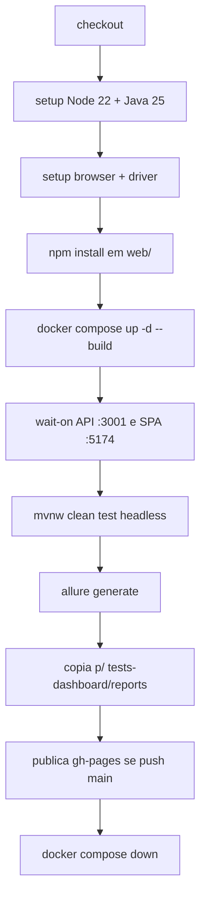

# 🧪 Selenium UI E2E (`selenium-e2e`)


Testes de interface com **Selenium WebDriver**, **JUnit 5** e **Page Object Model**. O `pom.xml` compila com **Java 21** (`maven.compiler.release=21`) e integra **Allure Report**, **WebDriverManager**, **dotenv-java** e **Datafaker**.

**Índice:** [Java 23 e 25](#-introdução-ao-java-23-e-25) · [Recursos Java 17+](#-recursos-java-17--exemplos-no-código) · [Java 21/22/23](#-recursos-java-21-22-e-23-no-projeto) · [Virtual threads](#-virtual-threads-java-21) · [Relatório headless](#relatório-headless-tempo--logs) · [Features](#-visão-geral-das-features) · [Requisitos](#-requisitos) · [Paralelismo](#-execução-paralela-junit) · [Page Object](#-padrão-page-object) · [Toast](#-toast-react-toastify) · [Executar testes](#-executar-todos-os-testes-global) · [GitHub Actions](#-esteira-github-actions) · [Allure](#-allure-report) · [Referências](#-referências-do-projeto)

## ☕ Introdução ao Java 23 e 25

Esta suite usa **duas camadas** de versão Java:

| Papel | Versão | Onde |
|-------|--------|------|
| **Compilação** | **21** (`maven.compiler.release=21` no `pom.xml`) | Código-fonte e bytecode dos testes |
| **Execução local** | **23** ou **25** (OpenJDK / Temurin) | `java`, Maven Wrapper, IDE ao rodar `mvn test` |
| **Execução na CI** | **25** (Temurin) | [`.github/workflows/selenium-e2e-pipeline.yml`](../../.github/workflows/selenium-e2e-pipeline.yml) — `java-version: 25` |

O **Java 23** (set/2024) e o **Java 25** (LTS set/2025) trazem runtime atualizado, melhor desempenho em I/O (browser, HTTP) e suporte às bibliotecas do módulo (Selenium 4.44, JUnit 5.11). O código **não exige** APIs exclusivas do 23 ou 25 para compilar: o baseline de linguagem continua sendo o **21** (`getFirst()`, virtual threads, etc.).

Para subir o `release` no `pom.xml` (ex.: `23` ou `25`), o **processo Maven** precisa usar um JDK **≥** essa versão — não basta ter o JDK instalado se o `java`/`javac` efetivo for mais antigo.

```bash
java -version
# Local (exemplos válidos):
# openjdk version "23.x" ...
# openjdk version "25.x" ...
```

> **Resumo:** compila com **21**; rode localmente com **23 ou 25**; na **CI** o padrão é **25**.

Instalação de JDK e `JAVA_HOME`: [Requisitos → Instalar o JDK](#instalar-e-configurar-o-jdk-23-ou-25).

---

## 🚀 Recursos Java 17+ — exemplos no código

Os exemplos abaixo existem no repositório e são validados por `JavaModernFeaturesTest` (sem WebDriver).

### `record` — DTOs imutáveis

Arquivo: `config/BrowserName.java`, `support/TestDataGenerator.java`

```java
public record BrowserName(String value) {
  public static final BrowserName CHROME = new BrowserName("CHROME");
}

public record UserData(String firstName, String lastName, String email, String password) {}
```

### Switch expression — mapeamento de browser

Arquivo: `config/BrowserName.java`

```java
return switch (normalized) {
  case "CHROME" -> CHROME;
  case "FIREFOX", "FF" -> FIREFOX;
  case "EDGE", "MSEDGE" -> EDGE;
  default -> throw new IllegalArgumentException("Unsupported browser: " + raw);
};
```

### Text block + `formatted()` — payloads JSON da API

Arquivo: `support/JsonPayloads.java` (usado por `ApiClient` e `AuthSessionHelper`)

```java
public static String loginBody(String email, String password) {
  return """
      {"email":"%s","password":"%s"}
      """
      .formatted(escapeJson(email), escapeJson(password));
}
```

### `String.formatted()` — seletores CSS

Arquivo: `support/Selectors.java` (usado por `BasePage.byTestId`)

```java
public static By byTestId(String testId) {
  return By.cssSelector("[data-testid='%s']".formatted(testId));
}
```

### Pattern matching `instanceof` — cast seguro no WebDriver

Arquivo: `pages/BasePage.java`, `tests/AbstractUiTest.java`

```java
// click(By) + fallback JS em ElementClickInterceptedException
if (driver instanceof JavascriptExecutor javascriptExecutor) {
  javascriptExecutor.executeScript("arguments[0].click();", element);
}

// screenshots Allure
if (driver instanceof TakesScreenshot takesScreenshot) {
  byte[] screenshot = takesScreenshot.getScreenshotAs(OutputType.BYTES);
}
```

### Switch com `->` — fluxo de cadastro

Arquivo: `pages/RegisterPageAction.java`

```java
switch (omitted) {
  case FIRST_NAME -> {
    fill(LAST_NAME, userData.lastName());
    fill(EMAIL, userData.email());
  }
  case EMAIL -> { /* ... */ }
}
```

### `HttpClient` + virtual threads — cliente REST nativo

Arquivo: `support/ApiClient.java` (detalhes em [Virtual threads](#-virtual-threads-java-21))

```java
private static final ExecutorService VIRTUAL_EXECUTOR =
    Executors.newVirtualThreadPerTaskExecutor();

private static final HttpClient HTTP =
    HttpClient.newBuilder()
        .version(HttpClient.Version.HTTP_1_1)
        .connectTimeout(Duration.ofSeconds(15))
        .executor(VIRTUAL_EXECUTOR)
        .build();
```

### Enum `PaymentMethod` — checkout parametrizado

Arquivo: `support/PaymentMethod.java` + `pages/CartCheckoutPageAction.java`

```java
// CartCheckoutFeatureTest — @EnumSource(PaymentMethod.class)
cartCheckout.whenAuthenticatedUserCompletesCheckoutToThankYou(paymentMethod);

// Page action — displayName / submitButtonText do enum
click(paymentMethodOption(paymentMethod.displayName()));
click(submitPaymentButton(paymentMethod.submitButtonText()));
```

### Rodar só os exemplos de linguagem (sem WebDriver)

```powershell
cd projects-tests/selenium-e2e
.\mvnw.cmd test -Dtest=JavaModernFeaturesTest
```

- **record** — Java 16/17: `BrowserName`, `TestDataGenerator.UserData`, `ApiClient.LoginResponse`
- **Switch expression** — Java 14/17: `BrowserName.fromSystemProperty`
- **enum** — `PaymentMethod` (CREDIT, DEBIT, PIX, BOLETO) nos fluxos de checkout
- **Text blocks** — Java 15+: `JsonPayloads`
- **formatted()** — Java 15+: `Selectors`, `JsonPayloads`
- **Pattern matching** — Java 16+: `BasePage`, `AbstractUiTest`
- **HttpClient** — Java 11+: `ApiClient`
- **Virtual threads** — Java 21+: `ApiClient` (ver seção dedicada)

---

## ☕ Recursos Java 21, 22 e 23 no projeto

Resumo honesto do que o código **realmente usa** (não apenas o que o JDK suporta).

### Java 21 — em uso

Baseline de compilação: `maven.compiler.release=21` no `pom.xml`.

- **`List.getFirst()`** — Sequenced Collections em `BasePage.clickFirst()` / `CatalogPageAction.whenAddFirstProductToCart()`.
- **`Executors.newVirtualThreadPerTaskExecutor()`** — `ApiClient` (HTTP e probes de login em paralelo). Ver [Virtual threads](#-virtual-threads-java-21).
- **`PaymentMethod` enum** — checkout parametrizado em `CartCheckoutFeatureTest` e `RealPurchaseFlowFeatureTest`.

```java
protected void clickFirst(By locator) {
  click(wait.until(ExpectedConditions.visibilityOfAllElementsLocatedBy(locator)).getFirst());
}
```

- **Demais construções** (`record`, text blocks, `formatted()`, pattern matching em `instanceof`) — ver [Recursos Java 17+](#-recursos-java-17--exemplos-no-código).

### Java 22 / 23 / 25 — runtime

- **CI:** **JDK 25** (Temurin) — ver [Introdução ao Java 23 e 25](#-introdução-ao-java-23-e-25).
- **Local:** JDK **23** ou **25** recomendado para executar; **21+** basta para compilar (`release=21`).
- Nenhuma API **exclusiva** de Java 22, 23 ou 25 é obrigatória no código hoje.

### Resumo

| Item | Valor |
|------|--------|
| Compila (`release`) | 21 |
| Executa (CI) | 25 |
| API 21+ no código | `getFirst()`, virtual threads, enum `PaymentMethod` |

---

## 🧵 Virtual threads (Java 21+)

[Virtual Threads (JEP 444)](https://openjdk.org/jeps/444) são threads leves da plataforma Java, ideais para **I/O** (HTTP, espera de rede). **Não substituem** o thread do browser: cada `@Test` Selenium continua com seu próprio `WebDriver` em thread de plataforma.

### Onde o projeto usa

| Local | O que faz |
|-------|-----------|
| `ApiClient.VIRTUAL_EXECUTOR` | `Executors.newVirtualThreadPerTaskExecutor()` compartilhado |
| `HttpClient.newBuilder().executor(...)` | Requisições REST (`login`, `register`, `GET /products`, `DELETE`) rodam no executor virtual |
| `tryLoginAdmin()` / `tryLoginSupport()` | Várias credenciais do `.env` são testadas **em paralelo**; retorna a primeira sessão válida **na ordem de prioridade** (E2E → SEED → fallback) |

### Trecho principal (`ApiClient`)

```java
private static final ExecutorService VIRTUAL_EXECUTOR =
    Executors.newVirtualThreadPerTaskExecutor();

private static final HttpClient HTTP =
    HttpClient.newBuilder()
        .version(HttpClient.Version.HTTP_1_1)
        .connectTimeout(Duration.ofSeconds(15))
        .executor(VIRTUAL_EXECUTOR)
        .build();
```

Probes de login (resumo do fluxo):

```java
for (String[] pair : pairs) {
  futures.add(
      VIRTUAL_EXECUTOR.submit(() -> tryLoginWithRole(pair[0], pair[1], roleCheck)));
}
// Resultados são lidos na ordem da lista (prioridade do .env preservada).
```

### Requisitos e limites

- **JDK 21+** no processo que executa os testes (`java -version`).
- **Compilação** continua com `maven.compiler.release=21` (virtual threads fazem parte da API estável do 21).
- **Benefício:** menos bloqueio ao resolver `tryLoginSupport()` com vários pares de credenciais e ao disparar várias chamadas HTTP na suíte.
- **Não usar** virtual threads para compartilhar um único `WebDriver` entre testes — o JUnit + Selenium não foram desenhados para isso.

### O que não mudou

- Paralelismo JUnit e browsers: ver [Execução paralela (JUnit)](#-execução-paralela-junit).
- `fill()` / `clearField()` na UI: ainda sincronizam no thread do teste que segura o driver.

---

## Relatório headless (tempo + logs)

Após `mvn test -Dheadless=true`, gere o relatório Markdown e o arquivo de log:

```powershell
.\scripts\run-headless-and-report.ps1
```

Ou manualmente:

```powershell
mvn test -Dheadless=true
python scripts/generate-headless-report.py --wall-clock-ms <ms> --maven-log logs/maven-console.log
```

| Artefato | Conteúdo |
|----------|----------|
| [HEADLESS-RUN-REPORT.md](HEADLESS-RUN-REPORT.md) | Resumo, **tempo médio**, **top 10** mais lentos, média por classe, falhas |
| `logs/headless-run-*.log` | Sumário, top 10, médias, stack traces, relatórios Surefire, console Maven |

`logs/*.log` está no `.gitignore` (não versionar).

---

## 🗂️ Visão geral das features

Cenários em `src/test/java/com/tester/web/e2e/tests/*FeatureTest.java`. Padrão: `given` / `when` / `thenValidated` nos Page Actions. Cada método usa `@DisplayName("TC-001 …")` com id **TC = Test Case**, sequencial **por classe** (`TC-001`, `TC-002`, …).

📋 **Documentação ATDD** (features, fluxos de tela e passo a passo): [docs/ATDD-TESTES.md](docs/ATDD-TESTES.md)

- 🔐 **Login** — `LoginFeatureTest`: login válido, redirect `next=/cart`, sessão após reload, credenciais inválidas, `maxLength` 30
- 🔐 **Register + Login** — `RegisterLoginFeatureTest`: cadastro+login, logout/re-login, senha errada
- 📝 **Register** — `RegisterFeatureTest`: cadastro PF, validações, e-mail duplicado
- 🌐 **Register + Language** — `RegisterLanguageFeatureTest`: cadastro, toggle PT/EN persistente
- 🛍️ **Catalog** — `CatalogFeatureTest`: listagem, busca, categoria, empty state, detalhes
- 📦 **Product Details** — `ProductDetailsFeatureTest`: dados do produto, add to cart, ID inválido
- 🛒 **Cart & Checkout** — `CartCheckoutFeatureTest`: checkout autenticado, quantidades, frete, thank-you
- 📋 **Orders Checkout (negativos)** — `OrdersCheckoutFeatureTest`: erros de pedido/pagamento via mock (Chrome/Edge, DevTools)
- 💳 **Payments** — `PaymentsCardBrandsFeatureTest`: bandeiras de cartão, detecção por BIN
- 🔁 **Real Purchase Flow** — `RealPurchaseFlowFeatureTest`: registro API → login → checkout real
- 🛡️ **Security** — `SecurityFeatureTest`: rotas protegidas, guest checkout, logout
- 👑 **Admin** — `AdminManagementFeatureTest`: admin lista/exclui produtos e usuários via API+UI
- 🎧 **Support Products** — `SupportProductsFeatureTest`: CRUD de produtos pelo perfil suporte

**Apoio:** `ApiClient` (REST), `AuthSessionHelper` (sessão no `localStorage`), Allure (screenshots).

---

## ✅ Requisitos

- **JDK** — **21+** para compilar (`release=21`); **23 ou 25** recomendado para executar os testes (a CI usa **25**)
- **Maven** — **4.0.0-rc-5** (obrigatório para `maven-compiler-plugin` 4.x). Use o **Maven Wrapper** (`mvnw` / `mvnw.cmd`) em `projects-tests/selenium-e2e/` — não precisa instalar Maven globalmente
- **Navegador** — Chrome, Firefox ou Edge instalados (drivers resolvidos via WebDriverManager)
- **Aplicação** — API (`server-ts`) em `http://127.0.0.1:3001` e SPA em `http://127.0.0.1:5174`
- **Seed** — `npm run seed` em `server-ts/` (admin, suporte, usuário normal)

> **Locale:** o `WebDriverFactory` força **pt-BR** nos browsers (Chrome/Edge/Firefox) para garantir textos em português.

### Instalar e configurar o JDK (23 ou 25)

1. Instale um **JDK 23** ou **JDK 25** (recomendado alinhar com a CI: **25** LTS — [Eclipse Temurin](https://adoptium.net/) ou distribuição corporativa).
2. Defina **`JAVA_HOME`** para a pasta raiz do JDK (não use apenas o JRE).
3. Confirme no terminal:

   ```bash
   java -version
   # esperado: 23.x ou 25.x (major ≥ 21 para compilar; 23+ recomendado para rodar)

   echo %JAVA_HOME%
   REM Windows CMD

   echo $env:JAVA_HOME
   REM Windows PowerShell
   ```

4. Reinicie o terminal/IDE depois de alterar variáveis de ambiente.

> Na **GitHub Actions**, o workflow fixa **Java 25**; localmente, **23** e **25** são equivalentes para esta suite, desde que `java -version` aponte para o JDK escolhido.

---

## 🚗 WebDriverManager

O [WebDriverManager](https://bonigarcia.dev/webdrivermanager/) (Bonigarcia) baixa e sincroniza **ChromeDriver**, **GeckoDriver** e **EdgeDriver** com o browser instalado.

**No projeto:** `WebDriverFactory` chama `WebDriverManager.chromedriver().setup()` (e equivalentes) antes de criar o driver.

```java
WebDriverManager.chromedriver().setup();
return new ChromeDriver(chromeOptions());
```

- `-Dbrowser=chrome` — padrão: Chrome headless ou headed
- `-Dbrowser=firefox` — CI Firefox: usa `FIREFOX_BIN` quando definido
- `headless=false` no `.env` — execução local com janela visível (padrão)
- `-Dheadless=true` — na CI / quando quiser headless; prevalece sobre o `.env`
- Padrão no `pom.xml`: `headless=false` (Surefire); Chrome/Edge usam `--headless=new` quando `true`

---

## 🔐 dotenv-java

O [dotenv-java](https://github.com/cdimascio/dotenv-java) carrega `projects-tests/selenium-e2e/.env` em `System.setProperty` no startup de `AbstractUiTest`.

**Chaves principais:** `BASE_URL`, `API_BASE_URL`, `LOGIN_*`, `E2E_ADMIN_*`, `E2E_SUPPORT_*`, `SEED_*`.

Valores entre aspas no `.env` são normalizados (`"senha@QA"` → `senha@QA`). O loader sobe diretórios a partir do CWD (IDE ou Maven).

---

## 🎲 Datafaker

O [Datafaker](https://www.datafaker.net/) gera massa de dados **pt-BR** em `TestDataGenerator`:

```java
private static final Faker FAKER = new Faker(new Locale("pt", "BR"));

public static UserData randomUser() { /* nome, e-mail, senha */ }
public static String validCpf() { /* CPF com dígitos verificadores */ }
```

Usado em `RegisterFeatureTest`, `RealPurchaseFlowFeatureTest`, `AdminManagementFeatureTest` e registro via `ApiClient`.

---

## 📁 Estrutura de pastas

```
projects-tests/selenium-e2e/
├── pom.xml
├── mvnw / mvnw.cmd           # Maven Wrapper
├── scripts/prepare_env.py    # provisiona JDK/truststore (cross-platform)
├── .mvn/wrapper/             # JAR + propriedades do wrapper
├── .env                          # credenciais locais (gitignored)
├── src/
│   ├── main/java/com/tester/web/e2e/
│   │   └── package-info.java
│   └── test/
│       ├── java/com/tester/web/e2e/
│       │   ├── config/      # Browser, WebDriver factory, propriedades de ambiente
│       │   ├── pages/       # *PageElements, *PageAction, NavBarElements, NavBarComponent, BasePage
│       │   ├── support/     # ApiClient, JsonPayloads, Selectors, TestDataGenerator, …
│       │   └── tests/       # Cenários (ex.: LoginFeatureTest)
│       └── resources/
│           └── junit-platform.properties  # auto-detection JUnit extensions (Allure)
└── target/                    # gerado pelo Maven (ignorado no Git)
    ├── allure-results/        # resultados crus após os testes
    └── site/allure-maven/     # relatório HTML após allure:report
allure-report/                 # relatório HTML gerado via Allure CLI (opcional)
```

A cache do relatório **Allure 3** usada pelo plugin pode aparecer também em `.allure/` (também ignorada no `.gitignore` deste módulo).

---

## ⚙️ Configuração (`.env`)

Arquivo em `projects-tests/selenium-e2e/.env` (não versionado). Alinhado ao seed de `server-ts/`:

```env
BASE_URL=http://127.0.0.1:5174
API_BASE_URL=http://127.0.0.1:3001/api

LOGIN_EMAIL=reinaldo.rossetti@outlook.com
LOGIN_PASSWORD=qualidade2026@QA

E2E_ADMIN_EMAIL=reiload@gmail.com
E2E_ADMIN_PASSWORD=rei2026@QA

E2E_SUPPORT_EMAIL=suporte@tester.com
E2E_SUPPORT_PASSWORD=suporte2026@QA
```

Antes dos testes:

```bash
cd server-ts && npm run seed && npm run dev
# em outro terminal:
cd projects-tests/selenium-e2e && ./mvnw clean test
```

---

## ⚡ Execução paralela (JUnit)

Arquivo: `src/test/resources/junit-platform.properties`.

| Propriedade | Valor | Significado |
|-------------|-------|-------------|
| `parallel.enabled` | `true` | Paralelismo JUnit 5 ativo (pool disponível) |
| `config.strategy` | `fixed` | Pool fixo (evite `dynamic.factor` em máquinas com poucos núcleos) |
| `fixed.parallelism` | `2` | Tamanho do pool JUnit (reservado se `mode.default=concurrent`) |
| `mode.classes.default` | `same_thread` | **Uma classe** `*FeatureTest` por vez |
| `mode.default` | `same_thread` | **Um método** `@Test` por vez dentro da classe |

### Estratégia atual (estável para UI)

- **Um `WebDriver` por `@Test`** — `AbstractUiTest` abre no `@BeforeEach` e encerra no `@AfterEach` (`closeBrowser`).
- **Uma feature por vez** e **um teste por vez** — evita corrida de carrinho/sessão com o usuário seed (`reinaldo@test.com`) e reduz flakiness de Chrome.
- **Virtual threads** no `ApiClient` são independentes: aceleram HTTP (login admin/support, register, cleanup), não paralelizam browsers.
- Para voltar a métodos concorrentes na mesma classe: `mode.default=concurrent` e ajuste `fixed.parallelism` (ex.: `3`) — só se cada teste usar usuário/dados isolados.

Desabilitar paralelismo JUnit para debug:

```powershell
.\mvnw.cmd test "-Djunit.jupiter.execution.parallel.enabled=false"
```

---

## ▶️ Executar todos os testes (“global”)

O Maven Wrapper fica em **`projects-tests/selenium-e2e/`**. Na raiz do repo `tester.com` use o caminho completo.

### Windows (recomendado)

**PowerShell** — na pasta do módulo:

```powershell
cd projects-tests/selenium-e2e
.\mvnw.cmd clean test
```

**CMD** — na pasta do módulo:

```bat
cd projects-tests\selenium-e2e
mvnw.cmd clean test
```

**Da raíz do repo** (PowerShell ou CMD), sem `cd`:

```bat
projects-tests\selenium-e2e\mvnw.cmd clean test
```

> No PowerShell use `.\mvnw.cmd` (com `.\`). Só `mvnw.cmd` pode não ser encontrado.

### Git Bash (MINGW64)

Na pasta do módulo:

```bash
cd projects-tests/selenium-e2e
./mvnw clean test
```

Da raiz do repo:

```bash
./projects-tests/selenium-e2e/mvnw clean test
```

### Linux / macOS

```bash
cd projects-tests/selenium-e2e
chmod +x mvnw
./mvnw clean test
```

### Maven instalado no sistema

```bash
mvn -f projects-tests/selenium-e2e/pom.xml clean test
```

### Problemas comuns no Windows

- `No such property: maven.mainClass` — causa: Maven Wrapper com Maven 4.0.0-beta-5 a rc-4 sem a propriedade de bootstrap. Solução: atualize o repo (`.mvn/jvm.config`, `mvnw` com `-Dmaven.mainClass=org.apache.maven.cling.MavenCling`, wrapper em **4.0.0-rc-5**) e rode de `projects-tests/selenium-e2e/` com `.\mvnw.cmd` ou `./mvnw`
- `No enum constant SourceVersion.RELEASE_23` (ou `RELEASE_25`) — causa: `release` no `pom.xml` maior que o JDK do processo Maven. Solução: mantenha `release=21` (padrão) **ou** configure IDE/terminal com JDK **≥** o `release` desejado (23 ou 25)
- `bash: ./mvnw: No such file or directory` — causa: comando na **raiz** do repo. Solução: `cd projects-tests/selenium-e2e`
- `mvnw.cmd: command not found` (Git Bash) — causa: sem caminho completo. Solução: `./projects-tests/selenium-e2e/mvnw.cmd clean test`
- `JAVA_HOME is set to an invalid directory` — causa: `JAVA_HOME` com pasta que não existe. Solução: corrija o `JAVA_HOME` para um JDK 23 ou 25 válido
- `PKIX path building failed` ao baixar do Maven Central — causa: certificado corporativo/SSL no Java truststore. Solução: importe o certificado da empresa no truststore do Java usado pelo Maven e/ou configure `~/.m2/settings.xml` corporativo

### TLS/PKIX sem permissão de administrador (Windows/Linux)

Se você não consegue alterar o `cacerts` global, use o truststore local do projeto via script Python:

```bat
cd projects-tests\selenium-e2e
mvnw.cmd clean test -Dbrowser=firefox -Dheadless=true "-Dbase.url=http://127.0.0.1:5174"
```

Esse comando:
1. Provisiona JDK (script Python; alvo compatível com o truststore);
2. Gera `.certs/maven-truststore.p12` com certificados do Windows;
3. Define `MAVEN_OPTS` com `javax.net.ssl.trustStore` para o Maven Wrapper.

### Propriedades úteis (linha de comando / CI)

- `browser` — exemplo: `-Dbrowser=chrome`. Descrição: `chrome`, `firefox` (ou `ff`), `edge` (ou `msedge`)
- `headless` — exemplo: `-Dheadless=true`. Descrição: `true`/`false`
- `base.url` — exemplo: `-Dbase.url=http://127.0.0.1:5174`. Descrição: URL da SPA
- `login.email` / `login.password` — exemplo: `-Dlogin.email=u@mail.com -Dlogin.password='Secret1!'`. Descrição: necessários para o teste feliz de login (`@EnabledIf`)

Exemplo combinado:

```bash
cd projects-tests/selenium-e2e
./mvnw clean test -Dbrowser=firefox -Dheadless=true "-Dbase.url=http://127.0.0.1:5174"
```

Windows (PowerShell):

```powershell
cd projects-tests/selenium-e2e
.\mvnw.cmd clean test -Dbrowser=firefox -Dheadless=true "-Dbase.url=http://127.0.0.1:5174"
```

---

## 🎯 Executar por feature (classe ou método)

```powershell
cd projects-tests/selenium-e2e
.\mvnw.cmd test -Dtest=CartCheckoutFeatureTest
.\mvnw.cmd test -Dtest=SupportProductsFeatureTest
.\mvnw.cmd test -Dtest=LoginFeatureTest#successfulLoginRedirectsToAccountArea
```

> O filtro `-Dtest=…` usa a convenção do **Maven Surefire** sobre o nome simples da classe (sem pacote).

---

Em caso de erro de certificado:
````
Importe o certificado raiz/intermediário da sua empresa no cacerts desse Java:

mvn compile -Daether.connector.https.securityMode=insecure
````

---

## 🔄 Esteira GitHub Actions

Workflow: [`.github/workflows/selenium-e2e-pipeline.yml`](../../.github/workflows/selenium-e2e-pipeline.yml)

### Quando roda

Dispara em **push** e **pull request** para `main`, quando há alterações em:

- `projects-tests/selenium-e2e/**`
- `web/**`
- `server-ts/**`
- `docker-compose.yml`
- o próprio workflow

### Jobs (paralelos)

- `selenium-e2e-chrome` — Chrome headless, timeout 45 min
- `selenium-e2e-firefox` — Firefox headless + geckodriver, timeout 45 min

### Fluxo de cada job



1. **Checkout** do repositório.
2. **Setup:** Node.js 22 (cache npm em `web/`), **Java 25** Temurin (cache Maven).
3. **Browser:** Chrome via `browser-actions/setup-chrome@v1`; Firefox via `setup-firefox@v1` + `setup-geckodriver@latest` (token `GITHUB_TOKEN`).
4. **Stack:** `docker compose up -d --build` (API + web + banco).
5. **Readiness:** `wait-on` em `http://127.0.0.1:3001/api/products` e `http://127.0.0.1:5174`.
6. **Testes:** `./mvnw clean test` em `projects-tests/selenium-e2e` (`continue-on-error: true`).
7. **Allure:** CLI 2.34.0 → gera `allure-report/`.
8. **Cópia:** relatório para `tests-dashboard/reports/selenium-allure-report-chrome|firefox/`.
9. **Publish:** em push na `main`, publica no branch `gh-pages` (`peaceiris/actions-gh-pages@v4`).
10. **Teardown:** `docker compose down` (sempre, via `if: always()`).

### Variáveis e secrets na CI

- `SELENIUM_LOGIN_EMAIL` — GitHub Secret — login nos testes autenticados
- `SELENIUM_LOGIN_PASSWORD` — GitHub Secret — senha do usuário de teste
- `GITHUB_TOKEN` — Actions (automático) — geckodriver + publish gh-pages
- `browser` — env do job — `chrome` ou `firefox`
- `headless` — env do job — `"true"`
- `BASE_URL` — env do job — `http://127.0.0.1:5174`
- `FIREFOX_BIN` — output do setup-firefox — caminho do Firefox (job Firefox)

Comando equivalente ao da esteira (Chrome):

```bash
cd projects-tests/selenium-e2e
./mvnw clean test \
  -Dbrowser=chrome \
  -Dheadless=true \
  -Dbase.url=http://127.0.0.1:5174 \
  -Dlogin.email="$LOGIN_EMAIL" \
  -Dlogin.password="$LOGIN_PASSWORD"
```

### Relatórios publicados

- Repo (cópia local no workspace) — `tests-dashboard/reports/selenium-allure-report-chrome/`
- Repo (cópia local no workspace) — `tests-dashboard/reports/selenium-allure-report-firefox/`
- GitHub Pages (`gh-pages`) — `tests-dashboard/reports/selenium-allure-report-chrome/`
- GitHub Pages (`gh-pages`) — `tests-dashboard/reports/selenium-allure-report-firefox/`

> Os testes usam `continue-on-error: true` — a pipeline gera relatório Allure mesmo com falhas. Verifique o status do job no GitHub Actions.

---

## 📊 Allure Report

Relatório online: [https://reinaldorossetti.github.io/amazonQA.com/tests-dashboard/reports/selenium-allure-report-chrome/](https://reinaldorossetti.github.io/amazonQA.com/tests-dashboard/reports/selenium-allure-report-chrome/)

1. Rode os testes para gerar `allure-results/`:

   ```powershell
   cd projects-tests/selenium-e2e
   .\mvnw.cmd clean test
   ```

2. **Gerar HTML estático**

   ```bash
   ./mvnw allure:report
   ```

   Windows: `.\mvnw.cmd allure:report`

   Abra o arquivo gerado pelo plugin Allure Maven (tipicamente):

   `target/site/allure-maven/index.html`

3. **Servir o relatório localmente** (abre no navegador)

   ```bash
   ./mvnw allure:serve
   ```

   Windows: `.\mvnw.cmd allure:serve`

4. **Allure CLI (opção direta, fora do Maven)**

    Gere o relatório e suba um servidor local:

    ```bash
    allure generate allure-results -o allure-report --clean
    allure open allure-report
    ```

    O servidor informa a URL local (ex.: `http://127.0.0.1:58xxx`).

> **Screenshots:** o projeto anexa imagens automaticamente **antes de cada teste** e ao final de validações de login (`validatedLoginPage` e `validatedLoginInPage`). Essas imagens aparecem no Allure.

O plugin **Allure Maven 3.x** usa por defeito o **runtime Allure 3** (Node empacregado pela cache sob `.allure/`). Para fixar uma versão concreta do CLI de relatório, consulte [Allure Maven](https://github.com/allure-framework/allure-maven) (`reportVersion`, etc.).

---

## 🌐 Ligação ao front-end do monorepo

Os seletores e fluxos espelham a app em **`web/`** e o exemplo Playwright em **`web/e2e`** (mesmos `data-testid`, rota `/login`, redirecionamento para `/minha-conta`). Garanta que o servidor de desenvolvimento da web está no ar na `base.url` configurada antes de executar os testes.

---

## 🧩 Padrão Page Object

Fluxo: `*FeatureTest` → `*PageAction` → `*PageElements` → `BasePage`

| Camada | Responsabilidade | Exemplo |
|--------|------------------|---------|
| **FeatureTest** | Cenário (`given` / `when` / `thenValidated`). Sem Selenium direto | `CartCheckoutFeatureTest` |
| **PageAction** | Navegação, cliques, fills, asserts, screenshots | `CartCheckoutPageAction` |
| **PageElements** | `protected static final By` e fábricas `By foo(...)` | `LoginPageElements` |
| **NavBarElements** + **NavBarComponent** | Seletores e ações da barra superior | `nav-cart-btn`, busca, logout |
| **BasePage** | Helpers compartilhados (`click`, `fill`, toast, Allure) | `BasePage` |

### By-first (obrigatório)

- Todo seletor em `*PageElements` como `By` (preferir `id` ou `data-element-id` da SPA).
- Page actions usam apenas constantes `By` herdadas + helpers do `BasePage` — **sem** `By.xpath` inline nas actions, **sem** `@FindBy` / `PageFactory`, **sem** `WebElement` nas actions.
- Clique padrão: `click(By)` — espera clicável, scroll/focus, clique nativo e fallback JS em `ElementClickInterceptedException`.

### Helpers do `BasePage` (nas PageActions)

| Helper | Uso |
|--------|-----|
| `click(By)` | Botões e links (fallback JS se interceptado) |
| `clickFirst(By)` | Primeiro item de uma lista (ex.: primeiro “Adicionar ao Carrinho”) |
| `fill(By, String)` | Limpa via `clearField`, foca e digita |
| `clearField(By)` / `clearFieldById(String)` | Limpa inputs React/MUI (`value = ''` + evento `input`) |
| `fillAndPressEnter(By, String)` | Busca no catálogo |
| `isVisible(By)` / `isPresent(By)` | Visível vs presente no DOM (`presenceOfElementLocated`) |
| `inputValue(By)` / `textOf(By)` | Ler valor ou texto |
| `setInputValueWithJs(By, String)` | Inputs controlados (pagamentos, quantidade) |
| `setFirstInputValueWithJs(By, String)` | Primeiro input da lista (ex.: quantidade no carrinho) |
| `waitUntilToastIsGone()` | Antes de cliques no header/carrinho/checkout |
| `waitUntilToastCycleCompletes()` | Depois de add/remove no carrinho |
| `ensureToastContainsOneOf(...)` | Toast com mensagem PT ou EN (ex.: e-mail duplicado) |

### `PaymentMethod` no checkout

O enum `support/PaymentMethod` centraliza rótulos PT/EN e textos do botão de confirmação. `CartCheckoutPageAction` monta os `By` via `paymentMethod.displayName()` e `paymentMethod.submitButtonText()` (helpers em `CartCheckoutPageElements`).

`PaymentsPageAction.whenClearCardNumber()` usa `clearField(CARD_NUMBER_INPUT)` para resetar o BIN antes de cada bandeira.

`WebElement` fica restrito à implementação privada do `BasePage` (ex.: `clickOnElement`).

Exemplo de elements:

```java
protected static final By EMAIL_INPUT = By.id("login-email");
protected static final By NAV_CART_BUTTON = By.id("nav-cart-btn");
```

Exemplo compacto no teste (sem linhas vazias entre passos):

```java
@Test
@DisplayName("TC-005 support should open create product modal")
void supportShouldOpenCreateProductModal() {
  supportProducts.whenOpenNewProductModal();
  supportProducts.thenValidatedCreateProductDialogVisible();
}
```

**IDs de caso de teste:** em cada `*FeatureTest`, o primeiro método é `TC-001`, o segundo `TC-002`, e assim por diante (três dígitos). `@ParameterizedTest` conta como um único TC.

Guia para agentes/IDE: `.cursor/skills/selenium-e2e-tests/SKILL.md`

---

## 🔔 Toast (react-toastify)

A SPA usa `ToastContainer` em **top-right** com `autoClose={5000}` (`web/src/App.jsx`) — mesma região do `#nav-cart-btn`. Toast visível pode causar `ElementClickInterceptedException`.

| Helper | Timeout | Quando usar |
|--------|---------|-------------|
| `waitUntilToastIsGone()` | até **7 s** (`TOAST_DISMISS_TIMEOUT`) | Antes de abrir carrinho, checkout, pagamento, logout |
| `waitUntilToastCycleCompletes()` | delega ao anterior se toast visível | Depois de adicionar/remover item no carrinho |

Locator: `TOAST_BODY` = `.Toastify__toast-body` no `BasePage`.

**Erro só no toast:** cadastro com e-mail duplicado e outros fluxos podem exibir mensagem apenas no toast — na PageAction use `thenValidatedToastErrorMessage` / `ensureToastContainsOneOf`, não só `ensureTextsVisible` no `body`.

`NavBarComponent.whenOpenCart()` e `whenLogout()` já chamam `waitUntilToastIsGone()`.

---

## 📚 Referências do projeto

Bibliotecas, plugins e documentação oficial usados em `projects-tests/selenium-e2e`.

### Stack principal

- **Java (JDK)** — `release=21` / CI com **JDK 25** — Linguagem e runtime — [Adoptium](https://adoptium.net/) · [Virtual Threads (JEP 444)](https://openjdk.org/jeps/444)
- **Selenium Java** — 4.44.0 — Automação WebDriver (Chrome, Firefox, Edge) — [selenium.dev](https://www.selenium.dev/documentation/) · [Maven Central](https://central.sonatype.com/artifact/org.seleniumhq.selenium/selenium-java)
- **JUnit Jupiter** — 5.11.4 — Runner, parametrização, paralelismo, assumptions — [JUnit 5 User Guide](https://junit.org/junit5/docs/current/user-guide/)
- **Maven Surefire** — 3.5.5 — Execução dos testes no build — [Surefire Plugin](https://maven.apache.org/surefire/maven-surefire-plugin/)
- **Maven Compiler Plugin** — 4.0.0-beta-4 — Compilação Java 21 (`release=21`; `release=23`/`25` exige Maven em JDK ≥ release) — [Compiler Plugin](https://maven.apache.org/plugins/maven-compiler-plugin/)
- **Apache Maven** — 4.0.0-rc-5 — Versão fixada no Maven Wrapper (`.mvn/wrapper/maven-wrapper.properties`)
- **Maven Wrapper** — 3.3.4 — Build reproduzível sem Maven global — [Maven Wrapper](https://maven.apache.org/wrapper/)

### Automação e dados

- **WebDriverManager** — 6.3.4 — Download/sync automático de ChromeDriver, GeckoDriver, EdgeDriver — [bonigarcia.dev/wdm](https://bonigarcia.dev/webdrivermanager/) · [GitHub](https://github.com/bonigarcia/webdrivermanager)
- **Datafaker** — 2.5.4 — Massa de dados pt-BR (`TestDataGenerator`) — [datafaker.net](https://www.datafaker.net/) · [GitHub](https://github.com/datafaker-net/datafaker)
- **dotenv-java** — 3.2.0 — Carrega `.env` do módulo (`EnvFileLoader`) — [GitHub](https://github.com/cdimascio/dotenv-java)

### Relatórios

- **Allure JUnit 5** — 2.34.0 — `@Epic`, `@Feature`, screenshots, steps — [docs.qameta.io/allure](https://docs.qameta.io/allure/)
- **Allure Maven Plugin** — 3.0.1 — `allure:report` / `allure:serve` local — [allure-maven](https://github.com/allure-framework/allure-maven)
- **Allure CLI** — 2.34.0 — Geração de HTML na CI — [Allure Report](https://github.com/allure-framework/allure2)
- **AspectJ Weaver** — 1.9.25.1 — Integração `@Step` com Surefire — [Eclipse AspectJ](https://www.eclipse.org/aspectj/)

### Monorepo (espelhado nos testes)

- **SPA React** — `web/` — Front-end testado (rotas, `id`, `data-testid`)
- **API REST** — `server-ts/` — Seed users, login, CRUD via `ApiClient`
- **Specs Playwright** — `web/e2e/` — Cenários de referência para paridade Selenium
- **Docker Compose** — `docker-compose.yml` — Stack local e CI (web + API + DB)

### Arquivos de configuração

- `pom.xml` — Dependências, Surefire, Allure, propriedades `-Dbrowser`, `-Dheadless`
- `.env` — Credenciais locais (`LOGIN_*`, `SEED_*`, `E2E_*`, `API_BASE_URL`)
- `src/test/resources/junit-platform.properties` — Paralelismo JUnit, autodetection Allure
- `.github/workflows/selenium-e2e-pipeline.yml` — Esteira CI (Chrome + Firefox)
