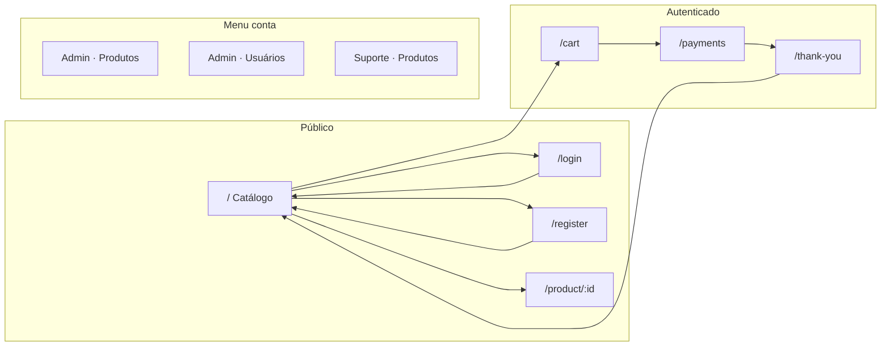

# Documentação ATDD — Selenium UI E2E

Documentação dos testes de interface em **ATDD** (Acceptance Test-Driven Development): intenção de negócio, features relacionadas, fluxo de telas e ações passo a passo.

```properties
epic=Web UI
modulo=projects-tests/selenium-e2e
base_url=http://127.0.0.1:5174    # variável BASE_URL
padrao=Page Object               # testes: given / when / thenValidated
```

---

## Convenções ATDD

```text
Feature   → capacidade de negócio (@Feature no Allure)
Cenário   → comportamento aceito (@DisplayName + método de teste)
Dado      → pré-condição / estado inicial da tela
Quando    → ações do usuário na UI
Então     → resultado observável (texto, URL, badge, modal, etc.)

Fluxo de tela = Tela → Ação → Próxima tela (sequência numerada em blocos de código)
```

---

## Mapa de telas (rotas)



```text
/                          → Catálogo de produtos (público ou pós-login)
/login                     → Entrar (link na navbar)
/register                  → Cadastro PF em 2 passos (link no login)
/product/{id}              → Detalhe do produto (clique na imagem no catálogo)
/cart                      → Carrinho (ícone na navbar)
/payments                  → Pagamento (finalizar compra no carrinho)
/thank-you                 → Obrigado / resumo do pedido
menu conta → Admin produtos → Gestão de produtos (sessão admin)
menu conta → Admin usuários  → Gestão de usuários (sessão admin)
menu conta → Suporte produtos → Gestão de produtos (sessão suporte)
```

---

## Índice de features

```text
Login                  → LoginFeatureTest                 (4 cenários)
Register               → RegisterFeatureTest              (7 + parametrizados)
Register and Language  → RegisterLanguageFeatureTest    (4)
Catalog                → CatalogFeatureTest               (6)
Product Details        → ProductDetailsFeatureTest        (4)
Cart and Checkout      → CartCheckoutFeatureTest          (15 + 4 pagamentos)
Payments Card Brands   → PaymentsCardBrandsFeatureTest    (4 + bandeiras)
Real Purchase Flow     → RealPurchaseFlowFeatureTest      (2)
Security               → SecurityFeatureTest              (3)
Admin Management       → AdminManagementFeatureTest       (2)
Support Products       → SupportProductsFeatureTest       (8)
```

---

## Feature: Login

```text
classe=LoginFeatureTest
objetivo=Validar autenticação na SPA e mensagens de erro
```

### Cenário: Login com sucesso

```gherkin
Cenário: Successful login redirects to the account area and shows the user greeting
  Dado que o usuário abre /login
  Quando valida textos da tela (Entrar, termos, criar conta, etc.)
    E preenche e-mail e senha válidos (LoginTestData)
    E clica em "Entrar"
  Então vê a saudação "Olá, Reinaldo" na aplicação
```

```text
Fluxo de tela:
  1. /login           → open()
  2. Login            → validatedLoginPage(textos[])
  3. Login            → fill(email, password)
  4. Login            → click "Entrar"
  5. Catálogo/conta   → validatedLoginInPage("Reinaldo")
```

### Cenário: Credenciais inválidas

```gherkin
Cenário: Invalid credentials show the API error alert
  Dado /login aberto
  Quando preenche e-mail válido e senha incorreta e confirma
  Então alerta visível: "Preencha e-mail e senha."
```

```text
Fluxo de tela:
  1. /login  → loginAction(email, wrongPassword)
  2. Login   → validatedErrorAlertVisible("Preencha e-mail e senha.")
```

### Cenário: Campos vazios / senha vazia

```gherkin
Cenário: Submitting empty fields shows client-side validation on the alert
  Dado /login aberto
  Quando submete com e-mail e senha vazios
  Então mesmo alerta de validação

Cenário: Submitting with empty password shows the same validation alert
  Dado /login aberto
  Quando submete e-mail válido e senha vazia
  Então mesmo alerta de validação
```

---

## Feature: Register

```text
classe=RegisterFeatureTest
objetivo=Cadastro PF em duas etapas (dados pessoais → endereço)
```

### TS01 — Cadastro com sucesso

```gherkin
Cenário: should successfully register when all requirements are valid
  Dado /register aberto
  Quando preenche dados pessoais + CPF válido (Datafaker)
    E clica "Avançar"
    E preenche endereço e envia
  Então mensagem de sucesso exibida
```

```text
Fluxo de tela:
  1. /register  → givenUserOnRegister()
  2. Passo 0    → whenFillPersonalData(user, cpf)
  3. Passo 0    → whenClickNext()
  4. Passo 1    → whenFillAddressAndSubmit()
  5. Passo 1    → thenValidatedSuccessMessage()
```

### Cenários de validação

```gherkin
TS02  Quando e-mail inválido          → Então mensagem de formato inválido
TS03  Quando senha curta no passo 0   → Então validação de senha
TS04  Quando senhas diferentes        → Então erro de confirmação
TS05  Quando campo obrigatório omitido (parametrizado) → Então não avança / mensagem por campo
TS06  Quando e-mail já cadastrado     → Então erro de duplicidade após submit
TS07  Quando todos os campos vazios   → Então mensagens individuais por campo
```

---

## Feature: Register and Language

```text
classe=RegisterLanguageFeatureTest
objetivo=Cadastro PF e internacionalização PT ↔ EN
```

### TS01 — Cadastro PF completo

```gherkin
Cenário: should complete PF registration successfully
  Dado /register
  Quando fluxo completo de cadastro (igual Register TS01)
  Então URL termina em / (catálogo)
```

### TS03 — Validação passo 0

```text
Fluxo de tela:
  1. /register  → givenUserOnRegister()
  2. Passo 0    → whenClickNext() sem preencher
  3. Passo 0    → thenValidatedErrorMessage("Nome é obrigatório.")
```

### TS01/TS02 — Idioma persiste após reload

```text
Fluxo de tela:
  1. /           → givenUserOnCatalog()
  2. /           → assert "Catálogo de Produtos"
  3. Navbar      → whenToggleLanguage()
  4. /           → assert "Product Catalog"
  5. Browser     → refresh()
  6. /           → assert "Product Catalog" (persiste)
```

### TS04 — Carrinho vazio em inglês

```text
Fluxo de tela:
  1. /      → toggle idioma EN
  2. /cart  → givenUserOnEmptyCart()
  3. Carrinho → textos: "Shopping Cart", "Your cart is empty", ...
```

---

## Feature: Catalog

```text
classe=CatalogFeatureTest
pre_condicao=givenUserOnCatalog() → /
```

```gherkin
TS01  Dado catálogo carregado     → Então imagens produtos 1 e 2 visíveis
TS02  Quando busca "Smartphone"   → Então só produto 5; contador "1 produto encontrado"
TS03  Quando filtra "Acessórios" → Então produto 1 visível; produto 5 oculto
TS04  Quando busca inexistente     → Então empty state
TS05  Quando clica imagem prod 1  → Então URL /product/1
TS06  Quando busca + detalhe + volta → Então busca "Smartphone" preservada
```

### TS06 — Filtro preservado após navegação

```text
Fluxo de tela:
  / → whenSearchBy("Smartphone")
  / → assert produto 5 visível; produto 1 oculto
  / → whenClickProductImage(5)
  /product/5
  /product/5 → whenBackToCatalog()
  / → thenValidatedSearchValueEquals("Smartphone")
  / → assert produto 5 visível; produto 1 oculto
```

---

## Feature: Product Details

```text
classe=ProductDetailsFeatureTest
```

```gherkin
TS01  Dado /product/1  → Então título "Relógio Elegante", imagem, preço R$ 50.99
TS02  Dado /product/1  → Quando quantidade 2 e Adicionar ao carrinho → Então badge 2
TS04  Dado /product/99999 → Então mensagem produto não encontrado
TS05  Dado /product/1  → Quando Voltar ao catálogo → Então URL /
```

```text
Fluxo TS02/03:
  /product/1 → whenSelectQuantity("2")
  /product/1 → whenAddToCart()
  Navbar     → thenValidatedCartBadgeEquals("2")
```

---

## Feature: Cart and Checkout

```text
classe=CartCheckoutFeatureTest
pre_condicao=givenLoggedInUser(reiload@gmail.com) → saudação "Olá, Reinaldo"
pagamentos_parametrizados=Crédito | Débito | PIX | Boleto
```

### TS01 — Checkout completo (parametrizado)

```gherkin
Cenário: authenticated user should complete checkout with payment method
  Dado usuário autenticado
    E carrinho com 1 item
  Quando completa checkout até /thank-you (PaymentMethod)
  Então resumo com:
    - "Obrigado pela sua compra!"
    - "Seu pedido foi processado..."
    - "Resumo do Pedido"
    - "Voltar ao Catálogo"
    - forma de pagamento correta no resumo
```

```text
Fluxo de tela:
  (login)     → givenLoggedInUser()
  Catálogo    → givenCartWithOneItem()
  /cart       → revisar itens
  /cart       → Finalizar compra
  /payments   → selecionar método + confirmar (Pagar agora | Gerar QR Code | Gerar boleto)
  /thank-you  → thenValidatedSuccessfulCheckoutSummary()
```

### Demais cenários

```gherkin
TS02  Dado 1 item     Quando Finalizar compra        Então URL /payments
TS03  Dado carrinho vazio  Quando abre /cart       Então empty state; checkout indisponível
TS04  Dado qtd 1      Quando altera para 3         Então total e badge 3
TS05  Dado qtd 1      Quando informa 0             Então qtd permanece 1
TS06  Dado qtd 1      Quando informa -2            Então qtd permanece 1
TS07  Dado qtd 1      Quando informa 25            Então total e badge atualizados
TS08  Dado qtd 1      Quando informa 2.9           Então normaliza para 2
TS09  Dado 1 item     Quando remove item           Então carrinho vazio
TS10  Dado 3 itens    Quando remove todos          Então empty state
TS11  Dado checkout Crédito  Quando volta ao catálogo e abre carrinho → Então vazio; badge 0
TS12  Dado 3 itens    Quando remove um a um        Então badge 3→2→1→0
TS13  Dado 3 itens    Quando qtd 1º item = 2       Então "Itens (3)" e "Subtotal (4 items)"
TS14  Dado item frete grátis                         Então "Grátis" + banner
TS15  Dado item "Câmera Vintage"                    Então frete R$ 16,00; sem banner grátis
```

---

## Feature: Payments Card Brands

```text
classe=PaymentsCardBrandsFeatureTest
pre_condicao=logado + 1 item no carrinho + URL /payments
```

```gherkin
TS01  Dado faixa oculta     Quando digita número cartão  Então faixa visível
TS02  Para cada CardBrand  Quando digita BIN da bandeira Então bandeira ativa
TS03  Quando número Visa   Então todas bandeiras aceitas visíveis
TS04  Quando preenche cartão + BIN  Então screenshot Allure pré-confirmação
```

```text
Fluxo TS02 (exemplo Visa):
  /payments → whenClearCardNumber()
  /payments → whenFillCardNumber(brand.cardNumber())
  /payments → thenValidatedBrandsStripVisible()
  /payments → thenValidatedBrandVisible(brand) + thenValidatedBrandActive(brand)
```

---

## Feature: Real Purchase Flow

```text
classe=RealPurchaseFlowFeatureTest
objetivo=Jornada E2E com usuário criado via API (Datafaker); cleanup admin no finally
```

### TS01 — Registro real + produto + Crédito

```gherkin
Cenário: real login random product checkout with credit card
  Dado usuário registrado via ApiClient.registerUser()
  Quando login UI → catálogo → 1º produto → carrinho → checkout Crédito
  Então thank-you com textos de sucesso
  E cleanup: ApiClient.deleteUser(admin, userId)
```

```text
Fluxo de tela:
  API         → registerUser(email único, Datafaker)
  /login      → loginAction(email, password)
  /login      → validatedLoginInPage(firstName)
  /           → whenAddFirstProductToCart()
  Navbar      → thenValidatedCartBadgeNotZero(); whenOpenCart()
  /cart       → thenValidatedUrlContains("/cart")
  /payments   → whenAuthenticatedUserCompletesCheckoutToThankYou(CREDIT)
  /thank-you  → thenValidatedSuccessfulCheckoutSummary(CREDIT, textos[])
  API         → deleteUser (finally)
```

### TS03 — Múltiplos produtos + PIX

```text
Fluxo de tela:
  API + /login  → usuário novo autenticado
  (interno)     → givenCartWithThreeItems(); badge 3
  checkout      → PIX → /thank-you
  API           → deleteUser (finally)
```

---

## Feature: Security

```text
classe=SecurityFeatureTest
objetivo=Proteção de rotas e revogação de sessão
```

```gherkin
SE01  Dado visitante com item no carrinho
      Quando tenta checkout em /cart
      Então redirect /login?next=...cart...

SE02  Dado visitante
      Quando acessa direto /thank-you
      Então redirect /login ou /

SE03  Dado usuário logado
      Quando logout na navbar
      Então saudação oculta
      E acesso /thank-you → /login?next=...thank-you...
```

```text
Fluxo SE01:
  /       → givenUserOnCatalog(); givenCartWithOneItem()
  /cart   → whenGuestTriesToCheckoutFromCart()
  /login  → thenValidatedUrlMatches(".*/login\\?next=(%2Fcart|/cart).*")

Fluxo SE03:
  /           → givenLoggedInUser()
  Navbar      → whenLogout(); thenValidatedUserGreetingHidden()
  /thank-you  → navigate direto
  /login      → thenValidatedUrlMatches login?next=thank-you
```

---

## Feature: Admin Management

```text
classe=AdminManagementFeatureTest
pre_condicao=AuthSessionHelper(admin) + givenAdminOnHome() → /
ordem_testes=@Order(1) produtos, @Order(2) usuários
```

### ADM01 — Excluir produto

```gherkin
Cenário: admin should list real products and delete the created one
  Dado produto criado via API
  Quando abre Admin · Produtos e exclui com confirmação
  Então produto não listado
```

```text
Fluxo de tela:
  API              → createProduct(adminToken, nome)
  /                → whenOpenAdminProducts()
  Admin produtos   → thenValidatedProductListed(nome)
  Admin produtos   → whenDeleteProduct(id); accept alert
  Admin produtos   → thenValidatedProductNotListed(nome)
```

### ADM02 — Excluir usuário

```text
Fluxo de tela:
  API              → registerUser(email único)
  /                → whenOpenAdminUsers()
  Admin usuários   → thenValidatedUserListed(email)
  Admin usuários   → whenDeleteUser(id)
  Admin usuários   → toast "Usuário excluído com sucesso."
  Admin usuários   → thenValidatedUserNotListed(email)
```

---

## Feature: Support Products

```text
classe=SupportProductsFeatureTest
pre_condicao=AuthSessionHelper(support) + givenSupportOnProductsPage()
```

```gherkin
SUP-UI01  Então tela de gestão visível (título, tabela)
SUP-UI02  Então tabela com produtos carregados
SUP-UI03  Dado produto criado via API → Quando busca pelo nome → Então listado
SUP-UI04  Quando busca inexistente → Então mensagem vazia
SUP-UI05  Quando Novo produto → Então modal cadastro aberto
SUP-UI06  Quando submit sem nome no modal → Então validação obrigatória
SUP-UI07  Dado produto API → Quando Editar → Então modal com nome pré-preenchido
SUP-UI08  Dado produto API → Quando Excluir na UI → Então some da lista
```

### SUP-UI05 — Abrir modal de cadastro

```text
Fluxo de tela:
  /                    → menu conta (suporte)
  Gestão de produtos   → whenOpenNewProductModal()
  Modal                → thenValidatedCreateProductDialogVisible()
```

---

## Papéis e dados de teste

```text
Cliente seed   origem=.env / LoginTestData
               uso=Login, Cart and Checkout, Payments Card Brands

Admin          origem=SEED_ADMIN_* / ApiClient.tryLoginAdmin()
               uso=Admin Management, cleanup Real Purchase Flow

Suporte        origem=SEED_SUPPORT_* / ApiClient.tryLoginSupport()
               uso=Support Products

Usuário efêmero origem=ApiClient + TestDataGenerator (Datafaker)
                uso=Real Purchase Flow, Register, Admin ADM02
```

---

## Rastreabilidade código ↔ documentação

```text
Testes (ATDD executável)  → src/test/java/com/tester/web/e2e/tests/*FeatureTest.java
Ações de tela               → src/test/java/com/tester/web/e2e/pages/*PageAction.java
Seletores                   → src/test/java/com/tester/web/e2e/pages/*PageElements.java
API / massa de dados        → src/test/java/com/tester/web/e2e/support/
Relatório Allure            → allure-report/  (epic: Web UI)
```

---

## Referências

```text
README do módulo     → ../README.md
Skill Selenium E2E   → ../../../.cursor/skills/selenium-e2e-tests/SKILL.md
Espelho Playwright   → web/e2e/specs/
```
