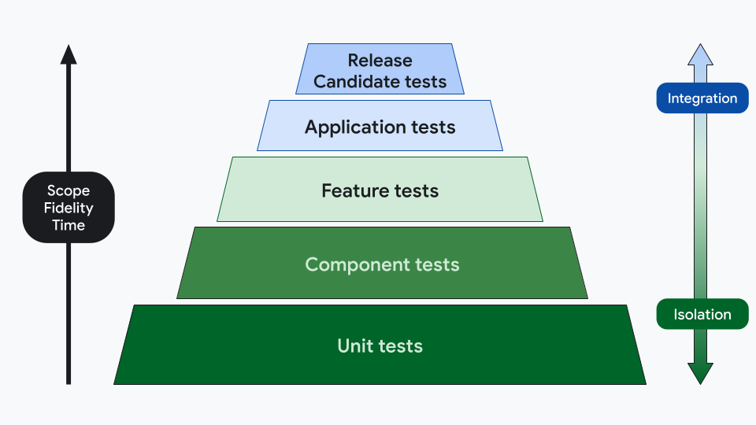
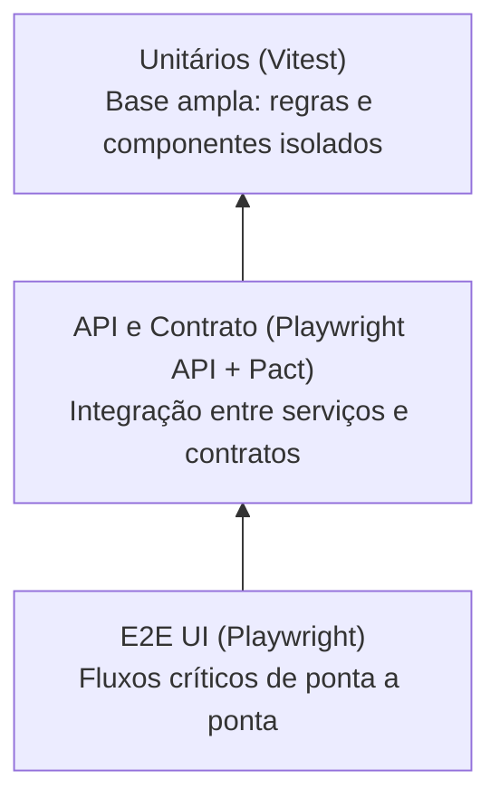

# tester.com — Resumo Consolidado dos Projetos

Este repositório reúne três aplicações integradas para o cenário de e-commerce:

- **Web (`/web`)**: interface React para clientes e fluxo administrativo.
- **Server (`/server`)**: API REST em Next.js com autenticação/autorização e integração com PostgreSQL.
- **Mobile (`/mobile`)**: app React Native (Expo) com paridade funcional da jornada principal.

## 🧪 Pirâmide de Testes

A estratégia de qualidade segue a pirâmide de testes: base ampla de testes unitários, camada intermediária para contratos/API e topo com E2E de interface.





**Relatórios públicos da pirâmide e da documentação:**

- **Índice geral de testes:** https://reinaldorossetti.github.io/amazonQA.com/tests-report/
- **Cobertura unitária (Vitest):** [Coverage](https://reinaldorossetti.github.io/amazonQA.com/tests-report/unit-tests/coverage/index.html)
- **Testes de API (Playwright):** [Playwright API](https://reinaldorossetti.github.io/amazonQA.com/tests-report/playwright-report-api/index.html)
- **Testes de contrato (Pact):** [Pact Contract Report](https://reinaldorossetti.github.io/amazonQA.com/tests-report/contract-tests/pacts/tester-web-frontend-tester-backend-api.json)
- **E2E Frontend (Playwright / Chromium):** [Browser Chromium](https://reinaldorossetti.github.io/amazonQA.com/tests-report/playwright-report-frontend-chromium/index.html)
- **E2E Frontend (Playwright / WebKit):** [Browser WebKit](https://reinaldorossetti.github.io/amazonQA.com/tests-report/playwright-report-frontend-webkit/index.html)
- **E2E Frontend (Playwright / Edge):** [Browser Edge](https://reinaldorossetti.github.io/amazonQA.com/tests-report/playwright-report-frontend-edge/index.html)
- **Swagger da API:** https://reinaldorossetti.github.io/amazonQA.com/tests-report/swagger/index.html
- **Guia completo de Pact:** [Guia de Testes de Pacto](pact-tests-guide.md)

---

## 📊 Relatórios e Dashboards (GitHub Pages)

Acompanhe os resultados diários, a cobertura e a documentação pública disponibilizada usando **GH-Pages** através dos nossos relatórios:

- 📑 **Todos os Testes (Índice):** [Visualizar Relatórios Gerais](https://reinaldorossetti.github.io/amazonQA.com/tests-report/)
- 📘 **Documentação Swagger (API):** [Swagger UI](https://reinaldorossetti.github.io/amazonQA.com/tests-report/swagger/index.html)
- 🧪 **Cobertura de Unitários/Unidade (Vitest):** [Unit Tests Coverage](https://reinaldorossetti.github.io/amazonQA.com/tests-report/unit-tests/coverage/index.html)
- 🔌 **Relatório de Testes de API:** [Playwright API Report](https://reinaldorossetti.github.io/amazonQA.com/tests-report/playwright-report-api/index.html)
- 🤝 **Relatório de Testes de Contrato (Pact):** [Pact Contract Report](https://reinaldorossetti.github.io/amazonQA.com/tests-report/contract-tests/pacts/tester-web-frontend-tester-backend-api.json)
- 📘 **Guia dos Testes de Pacto:** [pact-tests-guide.md](pact-tests-guide.md)

**📱 Relatórios UI E2E (Playwright por Browser):**
- 🌐 [Relatório Frontend - Chromium](https://reinaldorossetti.github.io/amazonQA.com/tests-report/playwright-report-frontend-chromium/index.html)
- 🌐 [Relatório Frontend - WebKit](https://reinaldorossetti.github.io/amazonQA.com/tests-report/playwright-report-frontend-webkit/index.html)
- 🌐 [Relatório Frontend - Edge](https://reinaldorossetti.github.io/amazonQA.com/tests-report/playwright-report-frontend-edge/index.html)

---

## 🤝 Testes de Contrato (Pact)

Os testes de contrato validam o acordo entre **frontend (consumer)** e **backend (provider)** sem depender de uma suíte E2E completa.

- 📄 **Report do contrato publicado (GH Pages):** [Pact Contract Report](https://reinaldorossetti.github.io/amazonQA.com/tests-report/contract-tests/pacts/tester-web-frontend-tester-backend-api.json)
- 📚 **Guia completo (implementação + execução):** [Guia de Testes de Pacto](pact-tests-guide.md)

Esse fluxo garante que mudanças na API não quebrem o consumo esperado no frontend e adiciona uma camada extra de segurança na esteira de CI.

---

## 🧭 Visão geral por projeto

### 1) Server API (`/server`)

Responsável por:

- Produtos (`/api/products`)
- Usuários (`/api/users`, login, registro, perfil)
- Carrinho (`/api/cart`)
- Pedidos (`/api/orders`)
- Pagamentos (`/api/orders/:id/payments`, boleto, etc.)

Também contém o script de preparação do banco:

- `npm run seed` → cria estrutura e popula produtos iniciais.

### 2) Web (`/web`)

Frontend React + Vite, com foco em:

- catálogo e busca;
- autenticação e jornada de compra;
- área administrativa;
- suíte de testes unitários, contrato (Pact) e E2E (Playwright).

### 3) Mobile (`/mobile`)

Aplicação React Native + Expo para Android/iOS, usando o mesmo backend do projeto web.

---

## 🚀 Ordem recomendada para subir localmente (DB primeiro)

> Fluxo recomendado: **subir o PostgreSQL via Docker → seed do backend → iniciar API → iniciar Web/Mobile**.

### 1. Subir o banco de dados

Na raiz do repositório:

```bash
docker compose up -d
```

### 2. Preparar e subir o backend

```bash
cd server
npm install
npm run seed
npm run dev
```

API local: `http://localhost:3001`

### 3. Subir o frontend web

Em outro terminal:

```bash
cd web
npm install
npm run dev
```

Web local: `http://127.0.0.1:5174`

### 4. Subir o app mobile (opcional)

```bash
cd mobile
npm install
npm run start
```

Se necessário, ajuste `EXPO_PUBLIC_API_BASE_URL` para o IP da sua máquina em emulador/dispositivo.

---

## 🧱 Tecnologias implementadas

### Server

- **Next.js** (API Routes / App Router)
- **PostgreSQL**
- **pg** (driver DB)
- **bcrypt** (hash de senha)
- **dotenv**

### Web

- **React 18** + **Vite**
- **React Router**
- **MUI**
- **React Toastify**
- **Vitest** + Testing Library
- **Playwright** (E2E/UI/API)
- **Pact** (consumer/provider)

### Mobile

- **React Native** + **Expo**
- **TypeScript**
- **React Navigation**
- **React Native Paper**
- **React Query**
- **Jest** (+ React Native Testing Library)
- **Detox** (E2E mobile)

---

## 📚 Links úteis de documentação

- **Documentação Web (detalhada)**: [`web/README.md`](web/README.md)
- **Documentação Server (detalhada)**: [`server/readme.MD`](server/readme.MD)
- **Documentação Mobile / plano**: [`mobile/README.md`](mobile/README.md)
- **Guia de testes de contrato (Pact)**: [`pact-tests-guide.md`](pact-tests-guide.md)
- **Guia de testes e esteira**: [`tests-readme.MD`](tests-readme.MD)
- **Swagger local**: [`docs/swagger/index.html`](docs/swagger/index.html)

Relatórios públicos (GitHub Pages):

- Índice de relatórios: <https://reinaldorossetti.github.io/tester.com/tests-report/>
- Swagger: <https://reinaldorossetti.github.io/tester.com/tests-report/swagger/index.html>

---

## 🔄 Testes na esteira (CI) e cobertura

A esteira está em: [`.github/workflows/e2e-pipeline.yml`](.github/workflows/e2e-pipeline.yml)

### O que roda automaticamente no CI

1. **Unit tests (Vitest)**
	- Executa com cobertura e relatório JUnit.
2. **Contract tests (Pact)**
	- Consumer + Provider.
3. **E2E Playwright (matriz)**
	- `frontend-chromium`, `frontend-webkit`, `frontend-edge` e `api`.
4. **Publicação de artefatos/report no GitHub Pages**
	- Playwright reports, cobertura unitária, pact artifacts e Swagger.

---

## 🧪 Como rodar os testes localmente

> Pré-requisito para testes de integração/E2E: backend e banco ativos (com seed executado).

### Web / raiz de testes

```bash
cd web
npm run test:unit
npm run test:coverage
npm run test:pact
npm run test:e2e
```

Comandos úteis adicionais:

```bash
npm run test:e2e:ui
npm run test:e2e:debug
npm run test:e2e:report
```

### Mobile

```bash
cd mobile
npm run test
npm run test:api
npm run e2e:build:android
npm run e2e:test:android
```

---

## ℹ️ Observação para Windows PowerShell

Se houver bloqueio por `ExecutionPolicy` ao usar `npm`, execute via `npm.cmd`.

