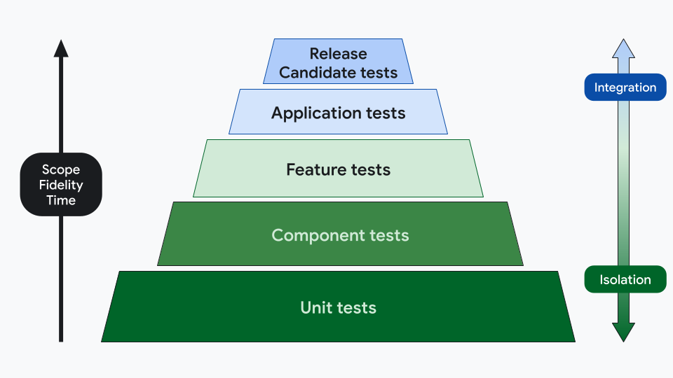
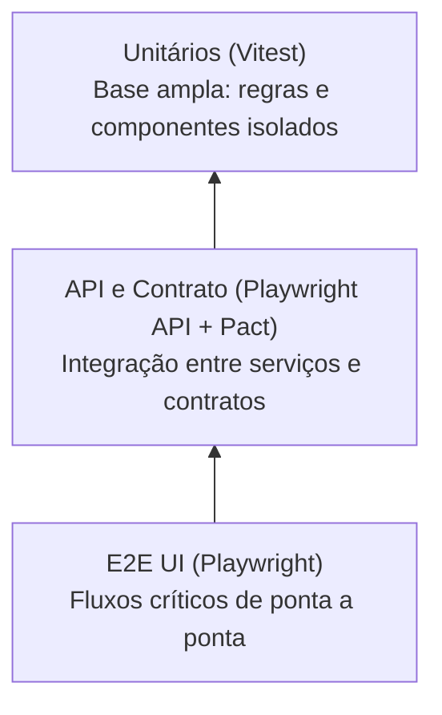

# 🛍️ tester.com — Plataforma de E-commerce para Testes de Qualidade

> Repositório de estudo e demonstração de **boas práticas de QA** sobre uma aplicação e-commerce real — cobrindo testes unitários, de contrato (Pact), API e E2E ponta a ponta com Playwright.

---

## 🎯 O que é este projeto?

O **tester.com** é uma plataforma de e-commerce completa, construída como ambiente de referência para engenharia de qualidade de software. Ele simula uma loja online com **jornada de compra real** — do cadastro ao pagamento — e serve de base para aplicar e demonstrar uma **pirâmide de testes escalável**.

### Principais jornadas cobertas

| Jornada | Descrição |
|---|---|
| 🔐 **Autenticação** | Cadastro de usuário, login, logout e proteção de rotas |
| 🛒 **Catálogo & Busca** | Listagem de produtos, filtro por categoria e busca por texto. Ao selecionar **Ofertas do Dia**, os produtos exibidos recebem **10% de desconto automático** no preço. |
| 🛍️ **Carrinho** | Adicionar/remover produtos, atualizar quantidades, badge do carrinho |
| 💳 **Checkout & Pagamento** | Fluxo completo: carrinho → pedido → pagamento → confirmação |
| 👤 **Área do Cliente** | Perfil, histórico de pedidos e gerenciamento de conta |
| 🔑 **Área Admin** | Gestão de produtos e usuários |

---

## 🏗️ Arquitetura — 3 aplicações integradas

```
tester.com/
├── 📁 web/      → React + Vite  (frontend da loja + testes)
├── 📁 server/   → Next.js API   (REST API + PostgreSQL)
└── 📁 mobile/   → React Native + Expo (app Android/iOS)
```

Todas as três aplicações compartilham o **mesmo backend** (`/server`), garantindo paridade funcional entre web e mobile.


### 📊 **Dashboard de Qualidade do Projeto:** 
[Dashboard](https://reinaldorossetti.github.io/amazonQA.com/tests-dashboard/index.html)  

---

## 🎬 Demonstração — Fluxo Completo em Vídeo (compra REAL, sem mock)

Os vídeos abaixo foram gerados automaticamente pelos **testes E2E do Playwright** rodando em Chromium, **sem nenhum mock de rede** — todos os produtos, pedidos e pagamentos foram processados pela API real em tempo de execução. Os produtos são selecionados aleatoriamente da API a cada execução.

### 🛒 Compra Completa com Cartão de Crédito (produto aleatório da API)

> **TS01** — Login real → produto aleatório sortido da API → carrinho → criação de pedido real → pagamento com cartão Visa → confirmação na página `/thank-you`. API retornou **HTTP 201 · status: authorized**.

[🎥 Assistir vídeo TS01 (local no repositório)](img/demo-checkout-real.webm)

### 🔍 Busca de Produto Real + Compra com Cartão

> **TS02** — Login real → busca pelo nome do produto via campo de pesquisa (dados da API) → adiciona ao carrinho → checkout → pagamento com cartão Visa → confirmação.

[🎥 Assistir vídeo TS02 (local no repositório)](img/demo-search-real.webm)

### 🟢 Múltiplos Produtos Aleatórios + Pagamento com PIX

> **TS03** — Login real → 3 produtos sortidos aleatoriamente da API adicionados ao carrinho → checkout → pagamento via **PIX** (QR Code gerado pela API) → confirmação.

[🎥 Assistir vídeo TS03 (local no repositório)](img/demo-pix-real.webm)

### 🔐 Login — Autenticando com credenciais válidas

> Teste `TS01` — Login com sucesso, redirecionamento para área logada e saudação ao usuário na NavBar.

https://github.com/reinaldorossetti/tester.com/raw/main/img/demo-login.webm

### 📝 Cadastro + Login — Fluxo E2E completo de novo usuário

> Teste `TS01` — Preenche formulário de cadastro em múltiplos passos (dados pessoais + endereço via ViaCEP), confirma cadastro e autentica com as mesmas credenciais.

https://github.com/reinaldorossetti/tester.com/raw/main/img/demo-register.webm

---

## 🧪 Pirâmide de Testes

A estratégia de qualidade segue a pirâmide de testes: base ampla de testes unitários, camada intermediária para contratos/API e topo com E2E de interface.




```mermaid
flowchart BT
    A["E2E UI (Playwright)<br/>Fluxos críticos de ponta a ponta"] --> B["API e Contrato (Playwright API + Pact)<br/>Integração entre serviços e contratos"]
    B --> C["Unitários (Vitest)<br/>Base ampla: regras e componentes isolados"]
```

### 📊 Suíte E2E Frontend — 12 specs / 60+ casos de teste

| Spec | Cobertura |
|---|---|
| `login.spec.ts` | Login válido, credenciais inválidas, campos vazios, navegação |
| `register.spec.ts` | Cadastro PF/PJ, validação de campos, CEP automático |
| `register-login.spec.ts` | Fluxo Register → Login → Logout → Re-login |
| `catalog.spec.ts` | Listagem, busca, filtro por categoria, detalhe do produto |
| `cart-checkout.spec.ts` | Carrinho, quantidades, remoção, checkout, pagamento |
| `orders.checkout.spec.ts` | Histórico e status de pedidos |
| `payments-card-brands.spec.ts` | Bandeiras de cartão, Pix, boleto |
| `product-details.spec.ts` | Página de detalhe, galeria, botão de compra |
| `auth.spec.ts` | Proteção de rotas, logout, sessão |
| `security.spec.ts` | Rotas protegidas sem autenticação |
| `admin-management.spec.ts` | Painel admin, gestão de produtos |
| `register-language.spec.ts` | Internacionalização do formulário de cadastro |

**Relatórios públicos da pirâmide e da documentação:**

- **Cobertura unitária (Vitest):** [Coverage](https://reinaldorossetti.github.io/amazonQA.com/tests-dashboard/unit-tests/coverage/index.html)
- **Testes de API (Playwright):** [Playwright API](https://reinaldorossetti.github.io/amazonQA.com/tests-dashboard/playwright-report-api/index.html)
- **Testes de contrato (Pact):** [Pact Contract Report](https://reinaldorossetti.github.io/amazonQA.com/tests-dashboard/contract-tests/pacts/tester-web-frontend-tester-backend-api.json)
- **E2E Frontend (Playwright / Chromium):** [Browser Chromium](https://reinaldorossetti.github.io/amazonQA.com/tests-dashboard/playwright-report-frontend-chromium/index.html)
- **E2E Frontend (Playwright / WebKit):** [Browser WebKit](https://reinaldorossetti.github.io/amazonQA.com/tests-dashboard/playwright-report-frontend-webkit/index.html)
- **E2E Frontend (Playwright / Edge):** [Browser Edge](https://reinaldorossetti.github.io/amazonQA.com/tests-dashboard/playwright-report-frontend-edge/index.html)
- **Swagger da API:** https://reinaldorossetti.github.io/amazonQA.com/tests-dashboard/swagger/index.html
- **Guia completo de Pact:** [Guia de Testes de Pacto](pact-tests-guide.md)

---

## 📊 Relatórios e Dashboards (GitHub Pages)

Acompanhe os resultados diários, a cobertura e a documentação pública disponibilizada usando **GH-Pages** através dos nossos relatórios:

- 📑 **Todos os Testes (Índice):** [Visualizar Relatórios Gerais](https://reinaldorossetti.github.io/amazonQA.com/tests-dashboard/index.html)

- 📘 **Documentação Swagger (API):** [Swagger UI](https://reinaldorossetti.github.io/amazonQA.com/tests-dashboard/swagger/index.html)

- 🧪 **Cobertura de Unitários/Unidade (Vitest):** [Unit Tests Coverage](https://reinaldorossetti.github.io/amazonQA.com/tests-dashboard/unit-tests/coverage/index.html)

- 🔌 **Relatório de Testes de API:** [Playwright API Report](https://reinaldorossetti.github.io/amazonQA.com/tests-dashboard/playwright-report-api/index.html)

- 🤝 **Relatório de Testes de Contrato (Pact):** [Pact Contract Report](https://reinaldorossetti.github.io/amazonQA.com/tests-dashboard/contract-tests/pacts/tester-web-frontend-tester-backend-api.json)

- 📘 **Guia dos Testes de Pacto:** [pact-tests-guide.md](pact-tests-guide.md)

**📱 Relatórios UI E2E (Playwright por Browser):**
- 🌐 [Relatório Frontend - Chromium](https://reinaldorossetti.github.io/amazonQA.com/tests-dashboard/playwright-report-frontend-chromium/index.html)
- 🌐 [Relatório Frontend - WebKit](https://reinaldorossetti.github.io/amazonQA.com/tests-dashboard/playwright-report-frontend-webkit/index.html)
- 🌐 [Relatório Frontend - Edge](https://reinaldorossetti.github.io/amazonQA.com/tests-dashboard/playwright-report-frontend-edge/index.html)


### E2E tests commands:


```
npx playwright test
# Runs the end-to-end tests.

npx playwright test --ui
# Starts the interactive UI mode.

npx playwright test --project=chromium
# Runs the tests only on Desktop Chrome.

npx playwright test example
# Runs the tests in a specific file.

npx playwright test --debug
# Runs the tests in debug mode.

npx playwright codegen
# Auto generate tests with Codegen.
```

---

## 🤝 Testes de Contrato (Pact)

Os testes de contrato validam o acordo entre **frontend (consumer)** e **backend (provider)** sem depender de uma suíte E2E completa.

- 📄 **Report do contrato publicado (GH Pages):** [Pact Contract Report](https://reinaldorossetti.github.io/amazonQA.com/tests-dashboard/contract-tests/pacts/tester-web-frontend-tester-backend-api.json)
- 📚 **Guia completo (implementação + execução):** [Guia de Testes de Pacto](pact-tests-guide.md)

Esse fluxo garante que mudanças na API não quebrem o consumo esperado no frontend e adiciona uma camada extra de segurança na esteira de CI.

---

## 🧭 Visão geral por projeto

### 1) Server API (`/server-ts`)

Responsável por:

- Produtos (`/api/products`)
- Usuários (`/api/users`, login, registro, perfil)
- Carrinho (`/api/cart`)
- Pedidos (`/api/orders`)
- Pagamentos (`/api/orders/:id/payments`, boleto, etc.)

Também contém os scripts do banco de dados na inicialização, que povoam sozinho as tabelas:

- `npm run seed` → cria estrutura e popula produtos iniciais (usado no boot do docker).
- `npm run db:reset` → **limpa todo o banco** e refaz o seed do zero.

### 2) Web (`/web`)

Frontend React + Vite, com foco em:

- catálogo e busca;
- autenticação e jornada de compra;
- área administrativa;
- suíte de testes unitários, contrato (Pact) e E2E (Playwright).

### 3) Mobile (`/mobile`)

Aplicação React Native + Expo para Android/iOS, usando o mesmo backend do projeto web.

---

## 🚀 Como Executar o Projeto (A forma mais fácil com Docker)

> Recomendamos fortemente rodar toda a aplicação baseando-se no `docker-compose.yml`, que sobe o Banco de Dados, a API e o site de uma vez só!

O repositório já conta com o Docker mapeado e linkado para as ferramentas necessárias, requerendo **zero configurações complexas de ambiente** da sua máquina.

### 🐳 Subindo tudo (One-Click Deploy)

Na pasta principal (raiz) do projeto, abra seu terminal e digite apenas isso:

```bash
docker compose up --build -d
```

Nesse momento o docker irá construir e subir os 3 serviços. É inteiramente automático. Quando finalizar, utilize:
- **Site (Frontend):** [http://localhost:5174](http://localhost:5174)
- **API (Backend):** [http://localhost:3001](http://localhost:3001)

*(O backend criará todas as tabelas e inserirá os 22 produtos falsos no banco sozinho graças ao "Seed" que executa durante a inicialização dele).*

---

### 💻 Como rodar "na mão" para Desenvolvimento (Sem os containers de App)

Se você precisa rodar no modo desenvolvedor clássico com os logs direto no seu terminal (necessita Node.js instalado na máquina):

#### 1. Subir "Apenas" o banco de dados
Mantenha um banco de pé via Docker para seu ambiente Node de dev consumir:
```bash
docker compose up -d postgres
```

#### 2. Subir o backend
```bash
cd server-ts
npm install
npm run dev
```

#### 3. Subir o frontend web
Em **outro terminal**:
```bash
cd web
npm install
npm run dev
```

#### 4. Subir o app mobile (opcional)
```bash
cd mobile
npm install
npm run start
```
Se necessário, ajuste `EXPO_PUBLIC_API_BASE_URL` para o IP da sua máquina em emulador/dispositivo.

---

## 🧱 Tecnologias implementadas

### Server

- **Next.js** (API Routes / App Router)
- **PostgreSQL**
- **pg** (driver DB)
- **bcrypt** (hash de senha)
- **dotenv**

### Web

- **React 18** + **Vite**
- **React Router**
- **MUI**
- **React Toastify**
- **Vitest** + Testing Library
- **Playwright** (E2E/UI/API)
- **Pact** (consumer/provider)

### Mobile

- **React Native** + **Expo**
- **TypeScript**
- **React Navigation**
- **React Native Paper**
- **React Query**
- **Jest** (+ React Native Testing Library)
- **Detox** (E2E mobile)

---

## 📚 Links úteis de documentação

- **Documentação Web (detalhada)**: [`web/README.md`](web/README.md)
- **Documentação Server (detalhada)**: [`server/readme.MD`](server/readme.MD)
- **Documentação Mobile / plano**: [`mobile/README.md`](mobile/README.md)
- **Guia de testes de contrato (Pact)**: [`pact-tests-guide.md`](pact-tests-guide.md)
- **Guia de testes e esteira**: [`tests-readme.MD`](tests-readme.MD)
- **Swagger local**: [`docs/swagger/index.html`](docs/swagger/index.html)

Relatórios públicos (GitHub Pages):

- Índice de relatórios: <https://reinaldorossetti.github.io/tester.com/tests-dashboard/>
- Swagger: <https://reinaldorossetti.github.io/tester.com/tests-dashboard/swagger/index.html>

---

## 🔄 Testes na esteira (CI) e cobertura

A esteira está em: [`.github/workflows/e2e-pipeline.yml`](.github/workflows/e2e-pipeline.yml)

### O que roda automaticamente no CI

1. **Unit tests (Vitest)**
	- Executa com cobertura e relatório JUnit.
2. **Contract tests (Pact)**
	- Consumer + Provider.
3. **E2E Playwright (matriz)**
	- `frontend-chromium`, `frontend-webkit`, `frontend-edge` e `api`.
4. **Publicação de artefatos/report no GitHub Pages**
	- Playwright reports, cobertura unitária, pact artifacts e Swagger.

---

## 🧪 Como rodar os testes localmente

> Pré-requisito para testes de integração/E2E: backend e banco ativos (com seed executado).

### Web / raiz de testes

```bash
cd web
npm run test:unit
npm run test:coverage
npm run test:pact
npm run test:e2e
```

#### Gravar vídeos dos testes E2E (demo)

```bash
# Na raiz do repositório — roda somente os testes real e grava os vídeos
npx playwright test --config playwright.video.config.ts --project="purchase flow"

# Os vídeos ficam em: img/demo-videos/
```

Comandos úteis adicionais:

```bash
npm run test:e2e:ui
npm run test:e2e:debug
npm run test:e2e:report
```

### Mobile

```bash
cd mobile
npm run test
npm run test:api
npm run e2e:build:android
npm run e2e:test:android
```

---

## 🗃️ Reset do banco de dados

Para limpar o banco e recriar do zero (útil antes de testes de integração):

```bash
cd server
npm run db:reset    # drop all tables → recria schema → insere produtos mock
```

O comando `npm run build` executa `db:reset` automaticamente antes de compilar.

---

## ℹ️ Observação para Windows PowerShell

Se houver bloqueio por `ExecutionPolicy` ao usar `npm`, execute via `npm.cmd`.
