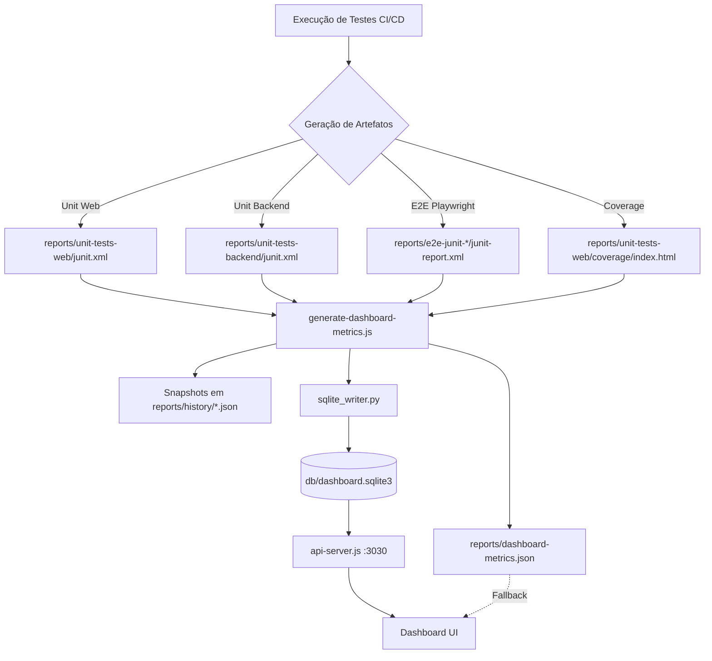

# 📊 Tests Dashboard

Painel de qualidade estático que lê artefatos de testes (JUnit, Coverage, Playwright) e exibe métricas via histórico de snapshots JSON. Publicado automaticamente via GitHub Actions no GitHub Pages.

👉 **[Leia as regras de arquitetura do dashboard aqui](docs/RULES.md)**

---

## 🗂️ Estrutura de Pastas

```
tests-dashboard/
│
├── index.html                       # Entry point do dashboard (publicado no gh-pages)
├── generate-dashboard-metrics.js    # Script Node.js executado pela esteira CI
├── api-server.js                    # Servidor local (API e SQLite interface)
├── sqlite_writer.py                 # Fallback para escrita no banco SQLite
├── server.bat                       # Helper Windows para iniciar o servidor local
│
├── db/                              # Banco de dados SQLite
│   └── dashboard.sqlite3            # Base de dados central de métricas
│
├── src/                             # Código-fonte JavaScript do dashboard
│   ├── dashboard-utils.js           # Helpers matemáticos, constantes e render utils
│   ├── dashboard-tabs.js            # Controlador de navegação por abas
│   ├── dashboard-summary.js         # Renderiza a aba "Resumo" (pirâmide + totais)
│   ├── dashboard-reports.js         # Renderiza a aba "Relatórios" (grid de links)
│   └── dashboard-metrics.js         # Renderiza a aba "Métricas CI" (gráficos, QA efficiency)
│
├── assets/                          # Arquivos estáticos de estilo e dados
│   ├── css/
│   │   └── dashboard-styles.css     # Estilos globais do dashboard (dark mode, componentes)
│   └── data/
│       └── dashboard-metrics-data.js # Fallback de dados para ambientes sem CI
│
├── reports/                         # Artefatos coletados e gerados (ignorado pelo git)
│   ├── dashboard-metrics.json       # JSON consolidado da última execução
│   ├── history/                     # Snapshots e lista de datas de execução
│   ├── e2e-junit-*/                 # Pastas com JUnit de Playwright (Chromium, Edge, etc.)
│   ├── unit-tests-*/                # Pastas com JUnit de testes unitários
│   └── coverage/                    # Relatórios de cobertura LCOV/HTML
```

> **Nota:** Os diretórios abaixo são gerados pela CI e **não devem ser commitados**:
> `unit-tests-web/`, `unit-tests-backend/`, `e2e-junit-*/`, `playwright-report-*/`

---

## 🚀 Dev Quickstart (local)

### 1. Inicie o servidor estático (da raiz do repo):
```bash
# gerar métricas
node ./tests-dashboard/generate-dashboard-metrics.js

# servir o dashboard em http://localhost:8080
npx http-server tests-dashboard -p 8080
# ou (Python 3)
python -m http.server 8000
# ou (Windows)
tests-dashboard/server.bat
```

### 2. Inicie a API de geração de métricas:
```bash
npm run dashboard-api
# ou
node ./tests-dashboard/api-server.js
```

### 3. Abra no navegador:
```
http://localhost:8000/tests-dashboard/index.html
```

---

## ⚙️ Como funciona a Esteira CI

O arquivo `.github/workflows/e2e-pipeline.yml` executa os seguintes jobs em paralelo:

| Job | O que faz |
|---|---|
| `unit` | Roda testes unitários Web (Vitest) e Backend-ts, faz upload dos artefatos |
| `contract` | Roda testes de contrato Pact, faz upload dos pacts gerados |
| `e2e` | Roda testes E2E Playwright em matrix (chromium, edge, api), faz upload do JUnit e HTML report |
| `deploy` | Baixa todos os artefatos, restaura histórico do gh-pages, executa o gerador e publica |

### O que o `generate-dashboard-metrics.js` produz:

- `dashboard-metrics.json` — dados da execução mais recente
- `history/YYYY-MM-DD-HHhMMm.json` — snapshot completo, incluindo seção `qaEfficiency`
- `history/dates.json` — índice com as últimas **7 execuções** (limite configurado do sidebar)
- `history/latest-scan.json` — metadados de debug da CI

---

## 📐 Métricas de Eficiência de QA (Cálculos e Validação)

As métricas exibidas no dashboard são calculadas automaticamente com base nos artefatos da esteira. Abaixo detalhamos as fórmulas e os pesos utilizados:

### 1. Automation ROI (Economia de Automação)
Calcula a economia financeira e de tempo baseada no histórico de execuções.
- **Fórmula**: `(Tempo Manual - Tempo Automático) × Nº de Execuções × Valor da Hora`
- **Pesos**:
    - Tempo Manual: **3 min** (0.05h) por teste E2E.
    - Tempo Automático: **0.2 min** (0.0033h) por teste E2E (considerando **2 execuções em paralelo**).
    - Valor da Hora: **R$ 60,00**.
    - Nº de Execuções: Contagem de snapshots em `history/dates.json` (considera as últimas **7 execuções**).
- **Exemplo**: 250 testes E2E executados 7 vezes economizam aproximadamente ~84.5h, gerando **R$ 5.073,60** de economia acumulada.


🧮 Validação do Cálculo (Cenário: 250 Testes)
Considerando os pesos atuais do sistema:
Regras: Somente considere os testes e2e para esse calculo, não considere testes unitarios.

Esforço Manual: 250 testes × 3 min = 750 min → 12.5 horas
Esforço Automatizado: 250 testes × 0.2 min = 50 min → 0.83 horas
Considerando 2 execuções em paralelo: 50 min / 2 = 25 min → 0.42 horas

Tempo Economizado (por execução): 12.5h - 0.42h = 12.08 horas
Economia Financeira (por execução): 12.08h × R$ 60,00/h = R$ 724,80
📅 Projeção Acumulada (Exemplo com Histórico)
Se o seu arquivo dates.json registrar 7 execuções (ex: uma por dia na semana):

Tempo Total Economizado: 12.08h × 7 = 84.56 horas
Economia Total Mensal: R$ 724,80 × 7 = R$ 5.073,60

### 2. Defect Density (Densidade de Defeitos)
Mede a qualidade intrínseca do código por volume.
- **Fórmula**: `Bugs Detectados / (Linhas de Código / 1000)`
- **Heurística**: Como o dashboard é estático, o volume de bugs é estimado como `Falhas Totais / 10`. O volume de código (KLOC) é extraído do `total lines` do relatório de cobertura Vitest.
- **Exemplo**: 5000 linhas de código com 20 falhas = `2 / 5 KLOC` = **0.40 bugs/KLOC**.

### 3. Flakiness Rate (Taxa de Instabilidade)
Identifica a saúde e confiabilidade da suíte E2E.
- **Fórmula**: `(Testes Instáveis / Total de Testes E2E) × 100`
- **Definição**: Testes que falharam e passaram na mesma execução (retries) ou marcados como `flaky` pelo Playwright.

### 4. Defect Leakage (Fuga de Defeitos)
Avalia a eficácia do processo de QA.
- **Fórmula**: `(Bugs de Produção / (Bugs de Produção + Bugs de QA)) × 100`
- **Fonte**: Os bugs de QA vêm da heurística de falhas, enquanto os de produção podem ser injetados via API/Snapshot.

### 5. Automation Coverage (Cobertura de Automação)
Acompanha o progresso da digitalização dos testes.
- **Fórmula**: `(Casos Automatizados / Casos Totais) × 100`
- **Nota**: O total de casos é a soma dos automatizados + uma estimativa de 15% de casos manuais remanescentes.

---

## 🏗️ Arquitetura de Dados e Lógica de Geração

O ecossistema do dashboard funciona através de um processo de descoberta automática (auto-discovery) de artefatos de testes.

### Fluxograma de Dados



### 🔍 Lógica de Descoberta (Auto-Discovery)

1.  **Testes Unitários**: O script busca arquivos `junit.xml` ou `unit-report.xml` em pastas específicas como `unit-tests-web` e `unit-tests-backend`.
2.  **Testes E2E (Playwright)**:
    *   O dashboard **não** analisa mais o HTML do Playwright diretamente.
    *   Ele busca por pastas que seguem o padrão `reports/e2e-junit-<projeto>/`.
    *   Dentro de cada pasta, ele lê o arquivo `junit-report.xml`.
    *   O nome do projeto no dashboard é derivado do sufixo da pasta (ex: `e2e-junit-chromium` vira o projeto `chromium`).
3.  **Persistência Híbrida**:
    *   **JSON**: Mantém a compatibilidade com o dashboard estático.
    *   **SQLite**: Permite consultas complexas e histórico robusto. Se o `better-sqlite3` falhar por problemas de drivers nativos, o sistema utiliza automaticamente um script Python (`sqlite_writer.py`) como fallback transparente.

## 📝 Notas Técnicas

- **API de Dados**: O dashboard tenta buscar dados em `http://localhost:3030/api/db-metrics`. Se a API não estiver rodando, ele usa o `reports/dashboard-metrics.json` como fallback.
- **Internacionalização**: Suporte total a PT-BR e EN via `src/i18n.js`.
- **Debug**: O arquivo `latest-scan.json` (em `history`) detalha exatamente quais caminhos foram varridos e o que foi encontrado (ou não).
- **Extensibilidade**: Para adicionar um novo projeto E2E, basta que a esteira de CI crie uma nova pasta `e2e-junit-NOME` com seu respectivo XML.

---
