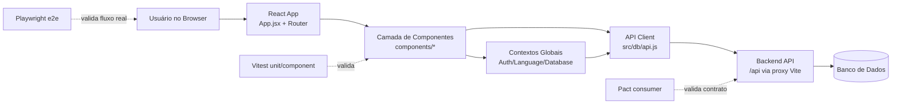

# Arquitetura do Projeto Web

## 1) Visão geral

O projeto `web/` é um frontend SPA em **React 18 + Vite**, com foco em e-commerce (catálogo, carrinho, checkout, pagamentos e área logada/admin).

Ele conversa com o backend via chamadas HTTP para `/api/*`, usando proxy do Vite para `http://localhost:3001` em desenvolvimento.

---

## 2) Estrutura arquitetural (camadas)

### 2.1 Entrada da aplicação

- `src/main.jsx`
	- monta a aplicação com `ReactDOM.createRoot(...)`;
	- aplica `React.StrictMode`;
	- injeta `DatabaseProvider` antes do `App`.

- `src/App.jsx`
	- define o **tema MUI**;
	- configura **roteamento** com `BrowserRouter`, `Routes` e `Route`;
	- centraliza `NavBar`, `Subnav`, `Footer` e `ToastContainer`;
	- aplica guards de rota:
		- `ProtectedRoute` para autenticação;
		- `AdminOnlyRoute` para perfil admin.

### 2.2 Camada de estado global (Context API)

- `src/contexts/AuthContext.jsx`
	- controla sessão (`auth_user`, `auth_token` no `localStorage`);
	- expõe `user`, `accessToken`, `isLoggedIn`, `login`, `logout`.

- `src/contexts/LanguageContext.jsx`
	- internacionalização **PT/EN**;
	- persistência de idioma em `localStorage` (`app_language`);
	- função `t(key, params)` para tradução/interpolação.

- `src/contexts/DatabaseContext.jsx`
	- provider de prontidão da camada de dados;
	- faz ping inicial via `getProducts()` para validar disponibilidade da API.

### 2.3 Camada de UI e domínio

- `src/components/`
	- catálogo e produto: `Catalog`, `Product`, `ProductDetails`;
	- carrinho/checkout: `Cart`, `CartItem`, `CheckoutButton`;
	- pagamentos: `PaymentsPage`, `payment/PaymentMethodSelector`, `payment/CardBrandChips`;
	- conta do usuário: `account/*`;
	- administração: `admin/*`.

Regras de negócio importantes no frontend:
- filtro combinado (busca + categoria + subnav);
- promoções como “Ofertas do Dia” com desconto em tempo de renderização;
- geração de `Idempotency-Key` no checkout;
- split payment com validações na tela de pagamento.

### 2.4 Camada de acesso a dados (API client)

- `src/db/api.js`
	- cliente HTTP centralizado (`http(method, path, body, headers)`);
	- adiciona `Authorization: Bearer <token>` automaticamente (exceto login/register);
	- limpa sessão local em respostas `401`;
	- expõe métodos por domínio:
		- products,
		- users,
		- cart,
		- orders,
		- payments.

### 2.5 Configuração de build/dev

- `web/vite.config.js`: roda o app da pasta `web/` e faz proxy de `/api` para `:3001`.
- `../vite.config.js` (raiz): alternativa para rodar Vite apontando `root: ./web`.

### 2.6 Estilo de arquitetura adotado (MVC, SOLID, Clean Code)

Este projeto **não segue MVC clássico** no frontend. Em vez disso, adota uma arquitetura moderna para SPA React:

- **Component-Based Architecture** (componentes reutilizáveis em `src/components`);
- **Camadas leves** (UI -> Contextos globais -> API client);
- **Organização por domínio funcional** (subpastas `account`, `admin`, `payment`).

Como os princípios foram aplicados:

- **SOLID (adaptado para React funcional)**
	- **SRP (Single Responsibility):** contexts separados (`AuthContext`, `LanguageContext`, `DatabaseContext`) e client HTTP centralizado em `src/db/api.js`.
	- **OCP/DIP (parcial):** componentes dependem de abstrações de contexto e funções de serviço, evitando acoplamento direto com `fetch` na UI.
- **Clean Code**
	- nomes semânticos de componentes e rotas;
	- separação de responsabilidades por arquivo/pasta;
	- cobertura de testes em múltiplas camadas (unit, contrato, e2e);
	- padrão consistente de lint e validação.

Resumo objetivo: a arquitetura é **React em camadas + organização por domínio**, com práticas de clean code e SOLID adaptado.

### 2.7 Lógica de organização de pastas no desenvolvimento

| Pasta/Arquivo | Papel | Lógica adotada |
|---|---|---|
| `web/src/components/` | Interface e fluxos de tela | Componentização por responsabilidade de UI e regras próximas ao domínio da tela. |
| `web/src/components/account/` | Área autenticada do usuário | Agrupar funcionalidades de conta para reduzir acoplamento com catálogo/checkout. |
| `web/src/components/admin/` | Funcionalidades administrativas | Isolamento de features sensíveis com rota protegida por perfil. |
| `web/src/components/payment/` | Subcomponentes de pagamento | Encapsular regras específicas (seleção de método, bandeira de cartão). |
| `web/src/contexts/` | Estado e serviços globais | Centralizar estados transversais (auth, idioma, disponibilidade de dados). |
| `web/src/db/api.js` | Gateway de backend | Ponto único de acesso à API, token bearer e tratamento padrão de erro/401. |
| `web/src/__tests__/` | Testes unitários/componentes | Testes próximos ao frontend para validar comportamento da UI e regras locais. |
| `web/e2e/` | Testes ponta a ponta | Separação clara entre teste de componente e fluxo real de usuário/browser. |
| `web/vitest*.config.js` | Configurações de teste por escopo | Isolar contexto de execução (frontend jsdom, pact consumer, API node). |

Em termos de processo, a lógica de desenvolvimento privilegia:

1. separar responsabilidades por contexto funcional;
2. manter o acesso a dados centralizado;
3. testar cada camada com a ferramenta adequada;
4. evoluir por módulos sem quebrar áreas não relacionadas.

---

## 3) Principais bibliotecas utilizadas

### Runtime (produção)

| Biblioteca | Versão | Finalidade |
|---|---|---|
| `react` | `^18.2.0` | Base da SPA (componentes, estado e ciclo de vida). |
| `react-dom` | `^18.2.0` | Renderização React no DOM. |
| `react-router-dom` | `^6.18.0` | Roteamento client-side. |
| `@mui/material` | `^7.3.9` | Componentes visuais e design system. |
| `@mui/icons-material` | `^7.3.9` | Ícones para UI. |
| `@emotion/react` | `^11.14.0` | Engine de estilos usada pelo MUI. |
| `@emotion/styled` | `^11.14.1` | API de styled components do ecossistema MUI. |
| `react-toastify` | `^9.1.3` | Feedback de ações (toasts). |
| `rxjs` | `^7.8.2` | Programação reativa/streams. |
| `rxdb` | `^16.21.1` | Camada de banco local orientada a reatividade. |
| `dexie` | `^4.3.0` | Abstração para IndexedDB. |
| `wa-sqlite` | `^1.0.0` | SQLite em ambiente web. |

### Desenvolvimento, testes e qualidade

| Biblioteca | Versão | Finalidade |
|---|---|---|
| `vite` | `^4.4.5` | Build e dev server. |
| `@vitejs/plugin-react` | `^4.7.0` | Integração React no Vite. |
| `vitest` | `^4.1.0` | Runner de testes unitários/componentes. |
| `@vitest/coverage-v8` | `^4.1.0` | Coleta de cobertura com provider V8. |
| `jsdom` | `^29.0.1` | Ambiente DOM para testes frontend. |
| `vitest-sonar-reporter` | `^3.0.0` | Report de testes para Sonar. |
| `@testing-library/react` | `^16.3.2` | Testes de UI orientados a comportamento. |
| `@testing-library/user-event` | `^14.6.1` | Simulação de interações reais de usuário. |
| `@testing-library/jest-dom` | `^6.9.1` | Matchers adicionais para assertions de DOM. |
| `@playwright/test` | `^1.59.1` | Testes E2E/browser e API. |
| `@pact-foundation/pact` | `^16.3.0` | Testes de contrato (consumer/provider). |
| `@pact-foundation/pact-cli` | `^18.0.0` | Ferramentas CLI para fluxo Pact. |
| `eslint` | `^8.45.0` | Lint e validação estática de código. |
| `eslint-plugin-react` | `^7.32.2` | Regras lint para React. |
| `eslint-plugin-react-hooks` | `^4.6.0` | Regras específicas para hooks React. |
| `eslint-plugin-react-refresh` | `^0.4.3` | Regras para integração com React Refresh. |
| `dotenv` | `^17.3.1` | Suporte a variáveis de ambiente em scripts. |
| `bootstrap` | `^5.2.3` | Utilitários e estilos auxiliares. |
| `@types/node` | `^25.5.2` | Tipagens TypeScript para Node.js. |
| `@types/react` | `^18.2.15` | Tipagens TypeScript para React. |
| `@types/react-dom` | `^18.2.7` | Tipagens TypeScript para React DOM. |
| `@faker-js/faker` | `^10.3.0` | Geração de dados fake para testes. |
| `axios` *(override)* | `^1.14.0` | Override de segurança/compatibilidade em dependências transitivas. |

---

## 4) Resumo do Vitest no projeto

O Vitest está organizado em **3 frentes**, com configs separadas para manter contexto e escopo de execução claros:

### 4.1 Testes unitários/componentes frontend

- Arquivo: `web/vitest.config.js`
- Ambiente: `jsdom`
- `setupFiles`: `src/__tests__/setup.js`
- Includes:
	- `src/**/*.test.{js,jsx,ts,tsx}`
	- `src/**/*.spec.{js,jsx,ts,tsx}`
- Excludes: `e2e/**`, `node_modules/**`, `dist/**`

Cobertura:
- provider `v8`;
- limiares mínimos: **80%** para lines/functions/branches/statements;
- relatórios: `text`, `json`, `html`, `lcov`, `text-summary`, `clover`.

### 4.2 Testes de contrato (Pact Consumer) via Vitest

- Arquivo: `web/vitest.pact.config.js`
- Ambiente: `jsdom`
- Include: `../tests/pact/consumer/**/*.test.js`
- Timeout: `30_000ms`
- Ajustes de `resolve.alias` para `@pact-foundation/pact`.

### 4.3 Testes de API server-side via Vitest

- Arquivo: `web/vitest.server.config.js`
- Ambiente: `node`
- Include: `tests/api/**/*.test.js`
- Com limpeza de mocks (`clearMocks`, `restoreMocks`).

### 4.4 Scripts de execução relevantes

- `test:unit`: executa suíte Vitest padrão.
- `test:watch`: modo watch.
- `test:coverage`: cobertura.
- `test:ui`: interface gráfica do Vitest.
- `test:pact:consumer`: Vitest com config de pacto.

Em resumo: o Vitest aqui cobre bem a base da pirâmide (componentes e regras), expande para contratos consumer (Pact) e também apoia testes de API específicos com configuração Node dedicada.

---

## 5) Diagrama da arquitetura de desenvolvimento

### 5.1 Fluxo principal da aplicação



### 5.2 Leitura do diagrama

- A UI é composta por componentes React e coordenada pelo roteamento em `App.jsx`.
- Estados transversais (sessão, idioma e disponibilidade de dados) ficam nos contexts.
- Toda integração com backend passa pelo gateway `src/db/api.js`.
- O proxy do Vite mantém chamadas em `/api/*` durante desenvolvimento.
- Qualidade é garantida por testes em três níveis: unidade/componente, contrato e e2e.

---

## 6) Lógica de desenvolvimento adotada no projeto

### 6.1 Estratégia de construção de features

1. **Criar/ajustar componentes de tela** no domínio correto (`components/`, `account/`, `admin/`, `payment/`).
2. **Conectar regras transversais** via contexto quando necessário (auth/idioma/dados).
3. **Implementar integração backend** exclusivamente em `src/db/api.js`.
4. **Adicionar cobertura de testes** na camada correspondente:
	 - unit/component em `src/__tests__`;
	 - contrato em `tests/pact/consumer`;
	 - e2e em `web/e2e`.
5. **Validar qualidade estática e execução** antes de merge.

### 6.2 Convenções práticas de organização

- **Coesão por domínio:** arquivos relacionados ficam próximos para facilitar manutenção.
- **Baixo acoplamento:** componente de UI não deve chamar `fetch` direto; usa `api.js`.
- **Responsabilidade única:** contextos separados por preocupação (auth, language, database readiness).
- **Evolução incremental:** mudanças pequenas e verificáveis, evitando efeitos colaterais amplos.

### 6.3 Critérios de qualidade para evolução contínua

- manter testes unitários/componente estáveis;
- preservar limiares de cobertura definidos no Vitest;
- garantir compatibilidade de contrato quando houver alteração de payload;
- validar fluxos críticos e2e (login, catálogo, carrinho, checkout/pagamento);
- manter documentação atualizada quando arquitetura/pastas mudarem.

### 6.4 Definition of Done (DoD) para Pull Requests

Uma feature/correção só é considerada pronta quando atende, no mínimo, os critérios abaixo:

1. **Funcionalidade**
	- comportamento implementado conforme regra de negócio;
	- sem regressão visível nos fluxos principais.

2. **Arquitetura e organização**
	- código inserido na pasta/domínio correto;
	- UI não acoplada diretamente a chamadas HTTP fora de `src/db/api.js`;
	- contextos usados apenas para estado transversal (evitar "contexto-de-tudo").

3. **Qualidade de código**
	- lint sem erros bloqueantes;
	- legibilidade mantida (nomes, funções e componentes claros);
	- sem duplicação desnecessária de lógica.

4. **Testes e validação**
	- testes unitários/componente atualizados quando aplicável;
	- contratos atualizados quando houver mudança de payload/semântica de API;
	- validação e2e dos fluxos críticos impactados.

5. **Documentação e rastreabilidade**
	- documentação atualizada (quando houver mudança arquitetural/fluxo);
	- PR com descrição clara de impacto, risco e plano de rollback (quando necessário).

---

## 7) Checklist padrão de PR (copiar e usar)

```md
## Checklist de qualidade

- [ ] Mudança implementada no domínio/pasta correta
- [ ] Sem chamadas HTTP diretas em componente (uso de `src/db/api.js`)
- [ ] Rotas/guards mantidos para auth/admin quando aplicável
- [ ] Testes unitários/componentes atualizados
- [ ] Contrato (Pact) revisado quando houver mudança de payload
- [ ] Fluxo e2e impactado validado
- [ ] Lint e validações locais executados
- [ ] Documentação atualizada (`web/arquitetura.MD`, se necessário)
- [ ] Riscos e impactos descritos na PR
```

---

## 8) Exemplo de PR preenchida (modelo prático)

```md
# feat(web): aplicar desconto de Ofertas do Dia no catálogo

## Contexto

Implementa regra de promoção no frontend para a subnav `Ofertas do Dia`,
exibindo preço original riscado + preço com desconto de 10% no card do produto.

## O que foi alterado

- Atualizado `web/src/components/Catalog.jsx` para aplicar desconto em tempo de renderização
	quando `selectedSubnavFilter === "ofertas-dia"`.
- Ajustado `web/src/components/Product.jsx` para exibir `originalPrice` e badge de desconto
	quando presentes.
- Atualizados testes de catálogo em `web/src/__tests__/components/Catalog.test.jsx`.
- Atualizada documentação em `web/arquitetura.MD`.

## Impacto esperado

- Fluxo de catálogo passa a refletir regra promocional em UI.
- Nenhuma alteração de payload no backend (regra puramente visual/frontend).

## Riscos

- Possível divergência de arredondamento de preço em casos específicos.
- Possível regressão visual em cards sem promoção.

## Mitigações

- Teste unitário cobrindo cálculo de desconto e presença de `originalPrice`.
- Validação manual no fluxo: subnav `Ofertas do Dia` e subnav `Todos`.

## Evidências de validação

- Unit/component (Vitest): ✅
- Contrato (Pact): N/A (sem mudança de contrato)
- E2E impactado (Playwright): ✅ cenário de navegação catálogo + filtro subnav

## Checklist de qualidade

- [x] Mudança implementada no domínio/pasta correta
- [x] Sem chamadas HTTP diretas em componente (uso de `src/db/api.js`)
- [x] Rotas/guards mantidos para auth/admin quando aplicável
- [x] Testes unitários/componentes atualizados
- [x] Contrato (Pact) revisado quando houver mudança de payload
- [x] Fluxo e2e impactado validado
- [x] Lint e validações locais executados
- [x] Documentação atualizada (`web/arquitetura.MD`, se necessário)
- [x] Riscos e impactos descritos na PR

## Plano de rollback

- Reverter commit da feature no frontend caso seja detectada regressão visual no catálogo.
- Não há necessidade de rollback de backend/banco para esta mudança.
```

